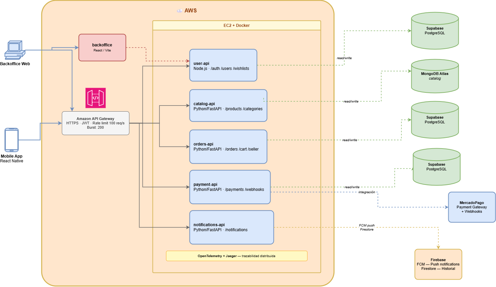

# ADR 0001: Adopción de Arquitectura de Microservicios

## Estado
Aceptado — Implementado

## Contexto
Para el desarrollo de la plataforma Bazaar (Ingeniería de Software II), necesitamos construir un sistema robusto que gestione múltiples dominios: usuarios, catálogos de productos, órdenes de compra transaccionales, pagos y notificaciones.

Un enfoque monolítico tradicional presentaría dificultades operativas y de rendimiento. Por ejemplo, el catálogo de productos requiere manejar un volumen de tráfico y búsquedas mucho mayor que el backoffice administrativo, por lo que necesita escalar de forma diferente. Además, es un requisito crítico del negocio que el fallo de un componente aislado (como la caída de la pasarela de pagos) no interrumpa la disponibilidad general del sistema, permitiendo que los usuarios sigan navegando por el catálogo.

## Decisión
Se adopta una arquitectura basada en **microservicios**. El sistema se divide en servicios independientes donde cada uno tiene responsabilidad sobre un único dominio de negocio, posee su propia base de datos y se despliega de forma separada.

### Vista general del sistema

### Servicios implementados

| Servicio | Stack | Rutas principales | Base de datos |
|---|---|---|---|
| **user-api** | Node.js / Express | `/auth` `/users` `/wishlists` | Supabase PostgreSQL |
| **catalog-api** | Python / FastAPI | `/products` `/categories` | MongoDB Atlas |
| **orders-api** | Python / FastAPI | `/orders` `/cart` `/seller` | Supabase PostgreSQL |
| **payment-api** | Python / FastAPI | `/payments` `/webhooks` | Supabase PostgreSQL + MercadoPago |
| **notifications-api** | Python / FastAPI | `/notifications` | Firebase Firestore + FCM |

### Infraestructura

- **Clientes:** Mobile App (React Native / Expo) y Backoffice Web (React / Vite).
- **Punto de entrada:** AWS API Gateway centraliza el enrutamiento, la validación JWT y el rate limiting (100 req/s, burst 200). Ver [ADR 0003](./0003-uso-api-gateway-y-auth.md).
- **Cómputo:** Los cinco microservicios corren en contenedores Docker dentro de una instancia EC2 (`us-east-2`), con NGINX como reverse proxy interno.
- **Observabilidad:** OpenTelemetry + Jaeger para trazabilidad distribuida entre servicios. Ver [ADR 0011](./0011-observabilidad-opentelemetry.md).

### Selección de base de datos por dominio

Cada servicio usa la tecnología de persistencia que mejor se adapta a su dominio:

- **PostgreSQL (Supabase):** usuarios, órdenes y pagos requieren integridad referencial y transacciones ACID.
- **MongoDB Atlas:** el catálogo de productos tiene esquema flexible (distintas categorías con atributos variables) que se adapta mejor a documentos.
- **Firebase Firestore + FCM:** el historial de notificaciones y el envío de pushes se gestionan dentro del mismo ecosistema Firebase.

## Alternativas descartadas

### Arquitectura monolítica
Descartada por acoplamiento total entre dominios: un cambio en el módulo de pagos requeriría re-desplegar toda la aplicación. El escalado independiente sería imposible.

### AWS App Runner
Evaluado en una etapa inicial. Se descartó en favor de EC2 + Docker por mayor control sobre la configuración de red, puertos y comunicación interna entre contenedores sin pasar por el gateway público.

## Consecuencias

### Positivas
- **Aislamiento de fallas:** si notifications-api cae, los usuarios pueden seguir comprando y navegando el catálogo sin interrupción.
- **Escalabilidad independiente:** es posible asignar más recursos únicamente a los servicios con mayor carga (e.g., catalog-api durante picos de búsqueda).
- **Despliegue independiente:** cada servicio tiene su propio repositorio y pipeline CI/CD; un cambio en orders-api no requiere re-desplegar user-api.
- **Tecnología por dominio:** cada servicio elige el stack y la base de datos más adecuados para su caso de uso.

### Negativas y Riesgos
- **Complejidad operativa:** mantener, monitorear y orquestar múltiples repositorios, contenedores y bases de datos requiere mayor esfuerzo de infraestructura.
- **Transacciones distribuidas:** sin transacciones ACID globales, flujos críticos como confirmar orden + descontar stock + procesar pago requieren el patrón **Saga** para garantizar consistencia eventual. Ver [ADR 0007](./0007-checkout.md).
- **Comunicación entre servicios:** se requiere lógica de idempotencia y resiliencia (retry, backoff exponencial) para tolerar fallos transitorios. Ver [ADR 0014](./0014-resiliencia-comunicacion-entre-servicios.md).
