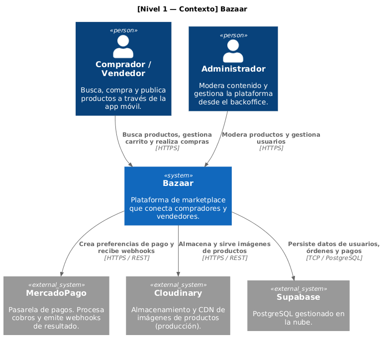
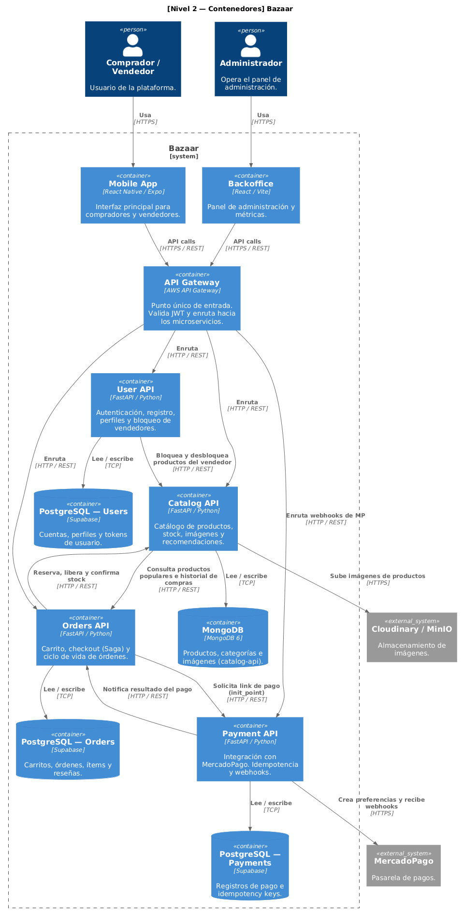
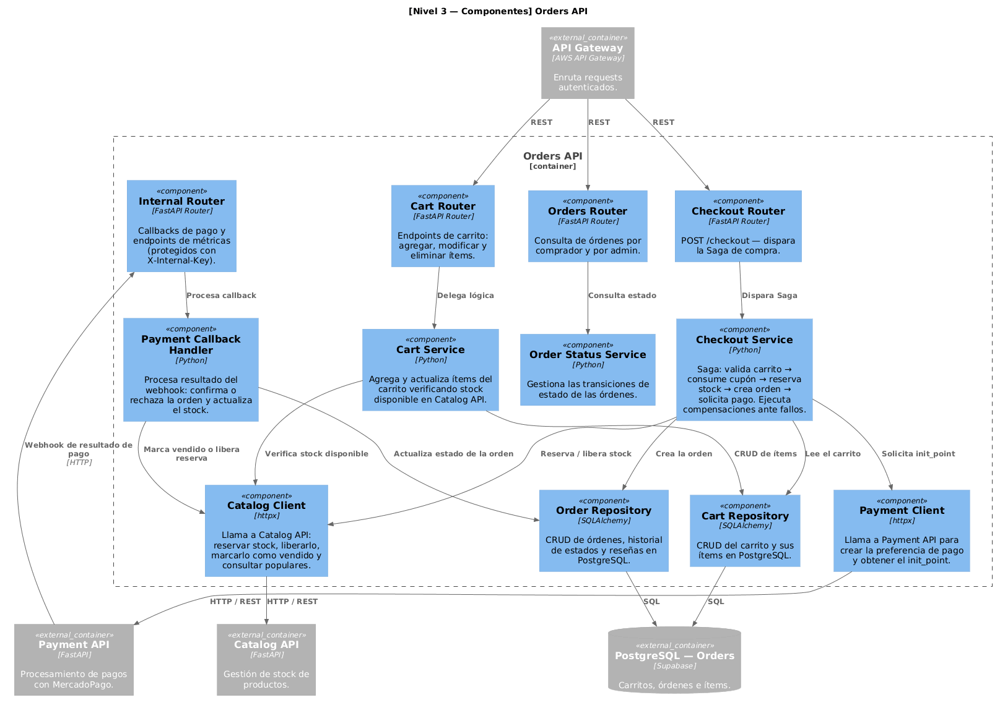

# Diagramas de Arquitectura

Diagramas generados siguiendo el modelo **C4** (Contexto → Contenedores → Componentes).

---

## Nivel 1 — Contexto del Sistema

Muestra quiénes interactúan con la plataforma y qué sistemas externos usa Bazaar. No entra en detalle sobre la tecnología interna.

**Actores:**
- **Comprador / Vendedor** — accede a la plataforma mediante la app móvil.
- **Administrador** — gestiona y modera la plataforma desde el backoffice web.

**Sistemas externos:**
- **MercadoPago** — pasarela de pagos que procesa cobros y notifica resultados vía webhook.
- **Cloudinary** — CDN de imágenes para productos en producción.
- **Supabase** — PostgreSQL gestionado en la nube para datos de usuarios, órdenes y pagos.

---

## Nivel 2 — Contenedores

Desglosa la plataforma en sus procesos y almacenamientos principales. Muestra las tecnologías usadas y cómo se comunican entre sí los microservicios.

**Decisiones clave:**
- El **API Gateway** (AWS) es el único punto de entrada público: valida el JWT y enruta al microservicio correspondiente.
- Cada microservicio tiene su **propia base de datos** (MongoDB para el catálogo, PostgreSQL independiente para usuarios, órdenes y pagos).
- La comunicación entre servicios es **sincrónica vía HTTP/REST** usando claves internas (`X-Internal-Key`) para endpoints sensibles.
- El flujo de checkout implementa el patrón **Saga** en Orders API para mantener consistencia distribuida entre stock, orden y pago.

---

## Nivel 3 — Componentes de Orders API

Muestra la estructura interna del microservicio más complejo: **Orders API**. Es el núcleo transaccional que implementa la Saga de checkout y coordina el stock con Catalog API y el pago con Payment API.

**Componentes principales:**
- **Checkout Service** — orquesta la Saga: valida el carrito, consume el cupón, reserva el stock, crea la orden y solicita el link de pago. Ante cualquier fallo intermedio ejecuta las compensaciones correspondientes.
- **Payment Callback Handler** — procesa el webhook de resultado: confirma la orden y marca el stock como vendido, o la rechaza y libera la reserva.
- **Catalog Client / Payment Client** — wrappers HTTP que encapsulan las llamadas a los otros microservicios.
- **Repositorios** — acceso a PostgreSQL vía SQLAlchemy, separados por agregado (carrito y orden).

