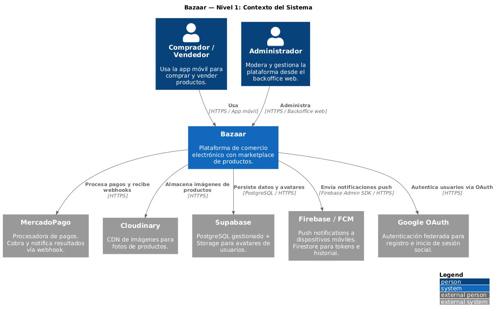
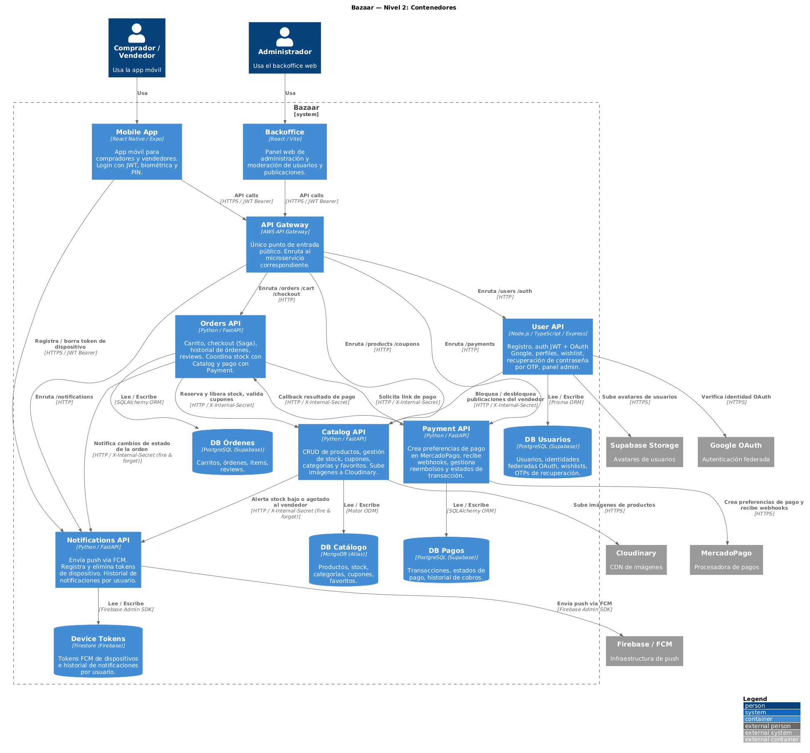
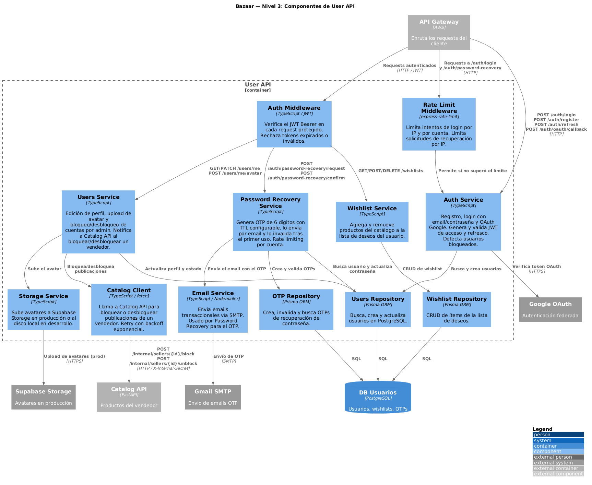
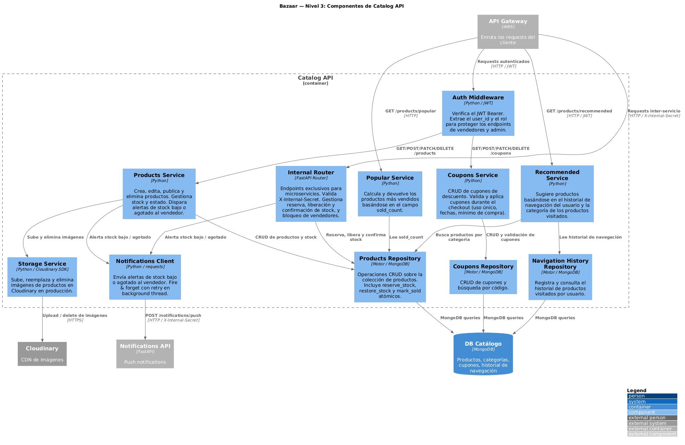
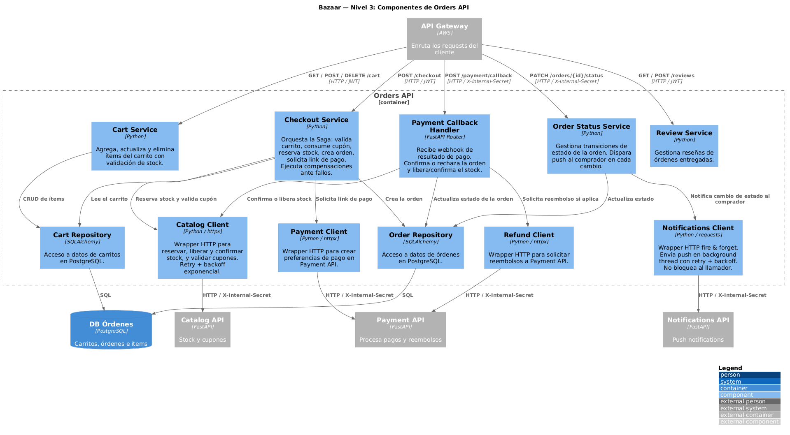
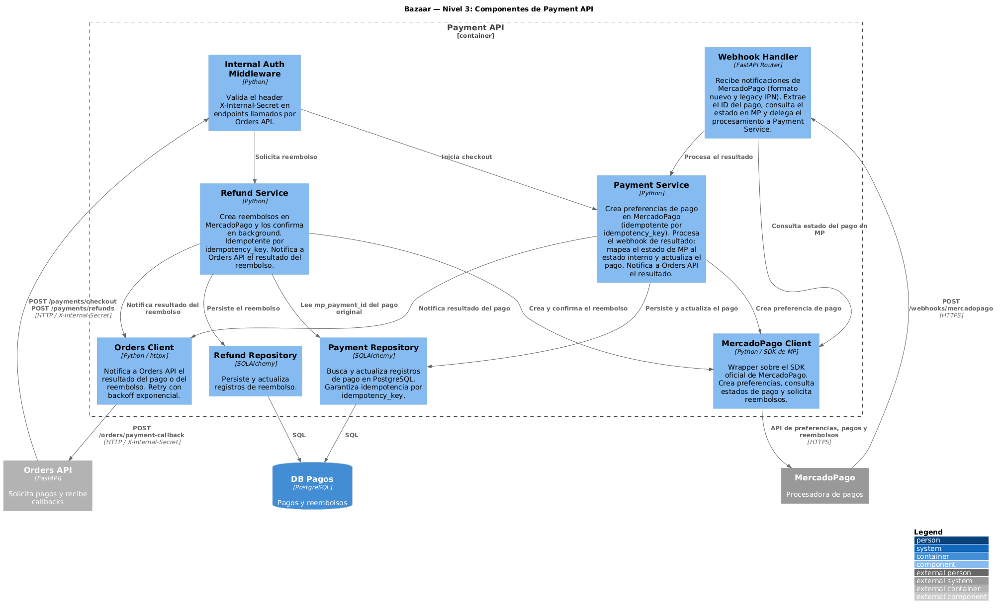
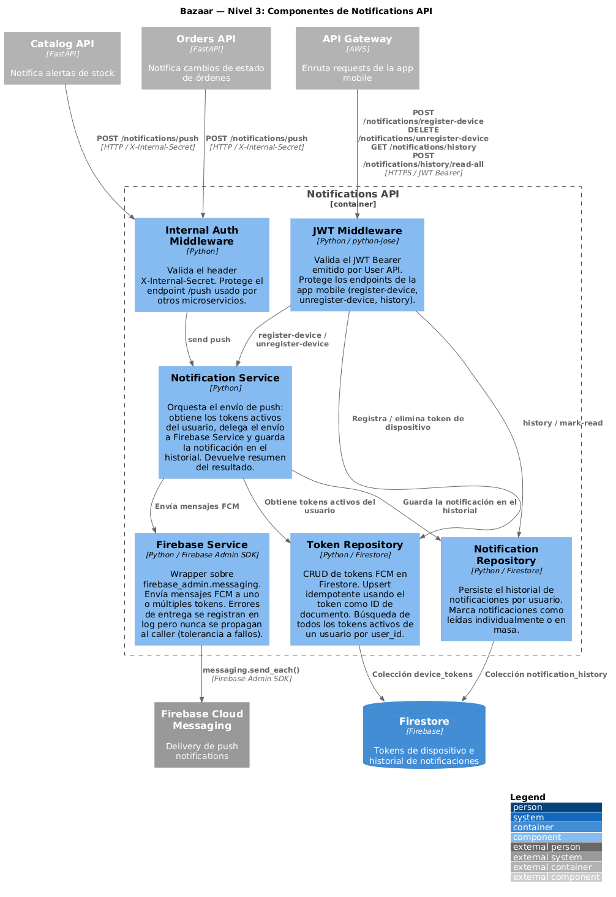

# Diagramas de Arquitectura

Diagramas creados siguiendo el modelo **C4** (Contexto → Contenedores → Componentes).

---

## Nivel 1 — Contexto del Sistema

EL siguiente diagrama muestra quiénes interactúan con la plataforma y qué sistemas externos usa Bazaar. No se entra en detalle sobre la tecnología interna.

**Actores:**
- **Comprador / Vendedor**: accede a la plataforma mediante la app móvil.
- **Administrador**: gestiona y modera la plataforma desde el backoffice web.

**Sistemas externos:**
- **MercadoPago**: pasarela de pagos que procesa cobros y notifica resultados vía webhook.
- **Cloudinary**: CDN de imágenes para productos en producción.
- **Supabase**: PostgreSQL gestionado en la nube para datos de usuarios, órdenes y pagos; también provee Storage para avatares.
- **Firebase / FCM**: infraestructura de Google para envío de push notifications a dispositivos móviles. Firestore almacena los tokens de dispositivo y el historial de notificaciones.
- **Google OAuth**: proveedor de autenticación federada para registro e inicio de sesión social.

---

## Nivel 2 — Contenedores

EL siguiente diagrama desglosa la plataforma en sus procesos y almacenamientos principales. Muestra las tecnologías usadas y cómo se comunican entre sí los microservicios.

**Decisiones clave:**
- El **API Gateway** (AWS) es el único punto de entrada público: valida el JWT y enruta al microservicio correspondiente.
- Cada microservicio tiene su **propia base de datos** (MongoDB para el catálogo, PostgreSQL independiente para usuarios, órdenes y pagos, Firestore para notificaciones).
- La comunicación entre servicios es **sincrónica vía HTTP/REST** usando claves internas (`X-Internal-Secret`) para endpoints sensibles, salvo las notificaciones que usan el patrón **fire & forget** con retry en background.
- El flujo de checkout implementa el patrón **Saga** en Orders API para mantener consistencia distribuida entre stock, orden y pago.
- Las **notificaciones push** están delegadas completamente a un microservicio dedicado (Notifications API), que abstrae Firebase/FCM del resto del sistema.

---

## Nivel 3 — Componentes

Los siguientes diagramas detallan la estructura interna de cada microservicio, mostrando cómo se organizan los servicios, repositorios, clientes HTTP y middlewares.

### Componentes de User API

Centro de autenticación, gestión de usuarios y perfil. Incluye registro, login con email/contraseña y OAuth Google, recuperación de contraseña por OTP, gestión de wishlists y panel administrativo para bloquear/desbloquear cuentas y publicaciones.

**Puntos clave:**
- **Auth Service**: genera JWT de acceso (corta duración) y refresh (30 días), valida OAuth con Google, detecta usuarios bloqueados.
- **Password Recovery Service**: OTP de 6 dígitos con TTL configurable (por defecto 60 min), validación de una sola hora de uso, rate limiting por account.
- **Storage Service**: abstrae el almacenamiento: Supabase Storage en producción, disco local en desarrollo.
- **Catalog Client**: notifica a Catalog API cuando un vendedor es bloqueado o desbloqueado, para ocultar o mostrar sus publicaciones.

---

### Componentes de Catalog API

Gestión del catálogo de productos, stock, cupones y categorías. Implementa búsqueda, filtrado, historial de navegación y recomendaciones personalizadas.

**Puntos clave:**
- **Products Service**: CRUD de productos, gestión de stock con operaciones atómicas (reservar, liberar, confirmar). Dispara alertas de stock bajo o agotado.
- **Coupons Service**: valida y aplica cupones durante checkout (validación de código, fechas de vigencia, monto mínimo, uso único).
- **Popular Service**: devuelve los productos más vendidos ordenados por sold_count.
- **Recommended Service**: sugiere productos basándose en el historial de navegación del usuario y categoria de productos visitados.
- **Notifications Client**: envía alertas de stock al vendedor en background sin bloquear el endpoint (fire & forget con retry).

---

### Componentes de Orders API

Núcleo transaccional del sistema. Implementa el carrito de compra, checkout (patrón Saga), historial de órdenes y reviews. Coordina stock con Catalog API, pago con Payment API y notificaciones con Notifications API.

**Puntos clave:**
- **Checkout Service**: orquesta la Saga: valida carrito, consume cupón, reserva stock, crea orden, solicita link de pago. Ejecuta compensaciones (libera stock, invalida cupón, cancela orden) ante cualquier fallo intermedio.
- **Order Status Service**: gestiona transiciones de estado de la orden (confirmada, en preparación, enviada, entregada, cancelada). Dispara push notification al comprador en cada cambio.
- **Payment Callback Handler**: recibe webhook de MercadoPago con resultado del pago, confirma o rechaza la orden, actualiza stock.
- **Cart Service**: agrega, actualiza y elimina ítems con validación de stock en tiempo real.
- **Notifications Client**: envía cambios de estado de la orden al comprador. Fire & forget con retry en background thread.

---

### Componentes de Payment API

Procesamiento de pagos con MercadoPago y gestión de reembolsos. Implementa idempotencia para operaciones de pago y reembolso.

**Puntos clave:**
- **Payment Service**: crea preferencias de checkout en MercadoPago (idempotente por `idempotency_key`). Procesa webhook de resultado: mapea estado de MP al estado interno (SUCCEEDED, FAILED, PROCESSING, REFUNDED, etc.).
- **Refund Service**: crea y confirma reembolsos en MercadoPago (idempotente). Simula demora configurable antes de confirmar. Notifica resultado a Orders API.
- **Webhook Handler**: recibe notificaciones de MercadoPago (formato nuevo JSON y legacy IPN con query params). Delega procesamiento a Payment Service.
- **MercadoPago Client**: wrapper sobre el SDK oficial de MP. Crea preferencias, consulta estados y solicita reembolsos.
- **Orders Client**: notifica a Orders API el resultado de pagos y reembolsos con retry y backoff exponencial.

---

### Componentes de Notifications API

Servicio dedicado para notificaciones push vía Firebase Cloud Messaging. Abstrae FCM del resto del sistema.

**Puntos clave:**
- **Notification Service**: orquesta el envío: obtiene tokens activos del usuario, delega a Firebase Service, guardarla en historial. Implementa patrón **fire & forget**: nunca bloquea al caller por fallo de FCM.
- **Firebase Service**: wrapper sobre `firebase-admin.messaging`. Envía mensajes FCM a uno o múltiples tokens. Errores de entrega se registran en log pero nunca se propagan (tolerancia a fallos).
- **Token Repository**: CRUD de tokens FCM en Firestore. Upsert idempotente usando el token como ID de documento. Búsqueda eficiente de todos los tokens de un usuario.
- **Notification Repository**: persiste el historial de notificaciones por usuario en Firestore. Marca notificaciones como leídas individualmente o en masa.
- **JWT Middleware**: protege endpoints de la app mobile (verificar Bearer token emitido por User API).
- **Internal Auth Middleware**: protege endpoint `/push` usado por otros microservicios (validar `X-Internal-Secret`).

---

## Flujos Transaccionales

### Checkout (patrón Saga)

1. **Orders API — Checkout Service** valida el carrito y aplica el cupón.
2. → **Catalog API — Internal Router** reserva el stock (operación atómica).
3. → **Payment API — Payment Service** crea la preferencia de checkout en MercadoPago.
4. → **Orders API** crea la orden en estado `PENDING_PAYMENT`.
5. Cliente realiza el pago en MercadoPago.
6. **MercadoPago webhook** → **Payment API — Webhook Handler** recibe la notificación.
7. → **Orders API — Payment Callback Handler** procesa el resultado.
8. Si **exitoso**: confirma stock, marca orden como `CONFIRMED`, envía push al comprador.
9. Si **fallo**: libera stock, cancela orden, devuelve cupón, envía push de fallo al comprador.

### Notificación de cambio de estado de orden

1. **Orders API** cambia el estado de la orden (ej: `SHIPPED`).
2. → **Notifications API — Notifications Client** (fire & forget en background thread).
3. → determinísticamente encontrar todos los tokens del comprador en Firestore.
4. → **Firebase Cloud Messaging** envía el push a cada dispositivo.
5. La app mobile registra la notificación en su historial local.

### Alerta de stock al vendedor

1. **Catalog API — Products Service** detecta que el stock cayó por debajo del umbral (ej: 5 unidades) o se agotó (0).
2. → **Notifications API — Notifications Client** (fire & forget en background thread con retry).
3. → busca el token del vendedor en Firestore.
4. → **Firebase Cloud Messaging** envía el push al dispositivo del vendedor.

---

## Patrones Arquitectónicos

### Saga Distribuida (Orders, Payment, Catalog)

El checkout coordina múltiples servicios manteniendo consistencia eventual:
- Cada paso es una transacción local en su base de datos.
- Si un paso falla, se ejecutan compensaciones en orden inverso (rollback distribuido).
- El patrón garantiza que no quedan órdenes en estado inconsistente.

### Fire & Forget (Notifications, Catalog)

Las notificaciones nunca bloquean al servicio llamador:
- El envío ocurre en un background thread.
- Retry automático con backoff exponencial para errores transitorios.
- Cualquier fallo se registra pero no se propaga al caller.
- La operación "principal" ya se completó exitosamente.

### Rate Limiting (User API)

Protección contra ataques de fuerza bruta:
- **Por IP**: límite global para mitigar ataques distribuidos.
- **Por cuenta (email)**: límite específico para cada usuario, independiente de IP.
- Solo se cuenta requests fallidos (exitosos no contribuyen al límite).

### Idempotencia (Payment API)

Garantiza que el mismo pago no se procesa dos veces:
- Cada request de pago lleva un `idempotency_key` único (generado por Orders API).
- Payment Service consulta primero si ya existe un pago con esa key.
- Si existe, devuelve el resultado previo sin llamar a MercadoPago nuevamente.

