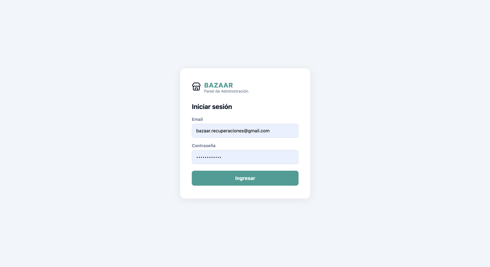
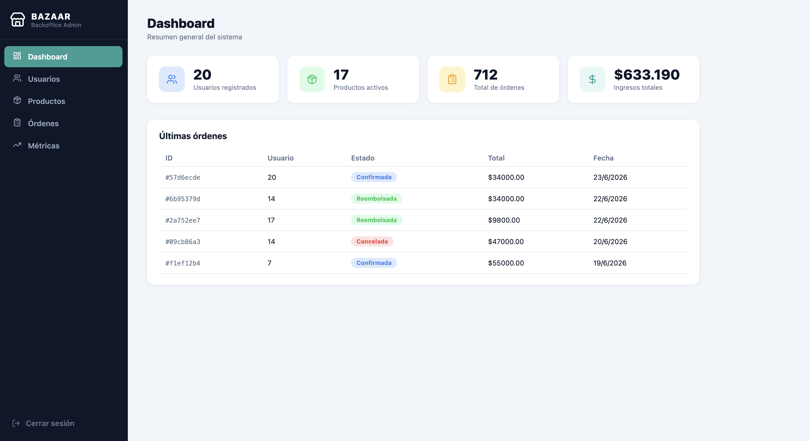
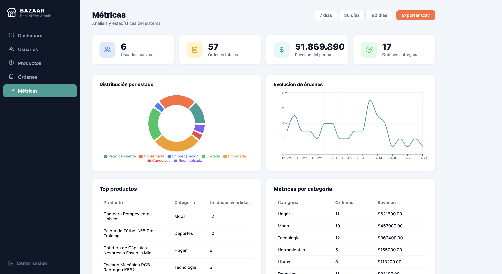
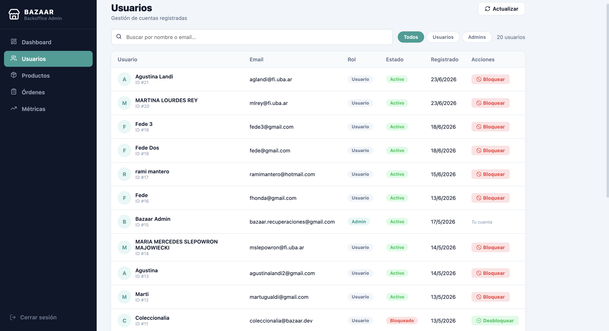
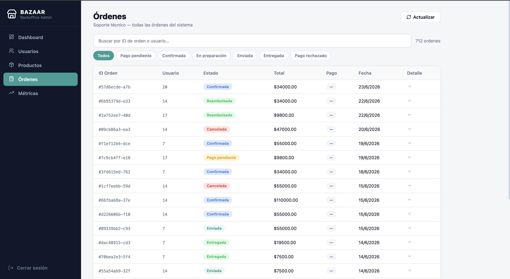
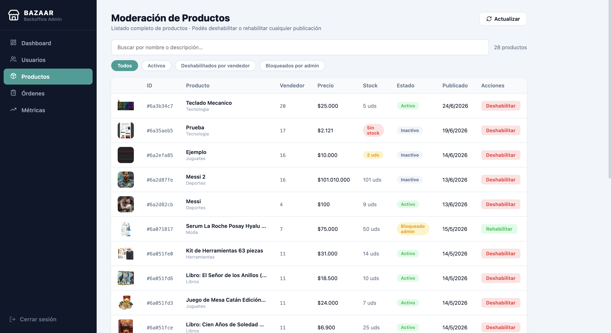

# Manual de Backoffice

## 1. Introducción

### 1.1 Función del documento

Este manual está dirigido al personal administrativo de Bazaar. Describe cómo utilizar el panel de backoffice para realizar tareas de supervisión y gestión interna del marketplace. No aplica a compradores ni vendedores, quienes interactúan con la plataforma a través de la aplicación móvil.

### 1.2 Descripción general

El backoffice de Bazaar es un panel web interno de administración del marketplace. Permite al equipo administrativo consultar métricas de actividad, gestionar cuentas de usuario, moderar publicaciones de productos y supervisar el estado de las órdenes. Todas las funcionalidades están restringidas a usuarios con rol `admin` y requieren autenticación previa.

---

## 2. Acceso al panel

### 2.1 Requisitos

- Navegador web moderno (Chrome, Firefox, Edge o Safari).
- Cuenta de usuario registrada en Bazaar con rol `admin`.

### 2.2 Inicio de sesión

**Pasos**

1. Abrí el panel en la URL de administración y accedé a la pantalla **"Iniciar sesión"**.
2. Completá el campo **Email** con tu dirección de correo electrónico (formato `admin@bazaar.com`).
3. Completá el campo **Contraseña** (mínimo 6 caracteres).
4. Hacé clic en el botón **"Ingresar"**. Mientras procesa, el botón muestra el texto `"Ingresando..."` y queda deshabilitado.

**Resultado**

Si las credenciales son válidas y la cuenta tiene rol `admin`, el token JWT se guarda en el almacenamiento local del navegador y el sistema redirige automáticamente al **Dashboard**.

**Notas**

El formulario valida los campos antes de enviar la solicitud. Los errores posibles son:

| Situación | Mensaje mostrado |
|-----------|-----------------|
| Email vacío | `"El email es obligatorio."` |
| Formato de email inválido | `"Ingresá un email válido."` |
| Contraseña vacía | `"La contraseña es obligatoria."` |
| Contraseña menor a 6 caracteres | `"La contraseña debe tener al menos 6 caracteres."` |
| Credenciales incorrectas (HTTP 401) | `"Credenciales incorrectas. Verificá tu email y contraseña."` |
| Usuario no encontrado (HTTP 404) | `"Usuario no encontrado."` |
| Cuenta sin permisos de admin (HTTP 403) | `"No tenés permisos de administrador."` |
| Token válido pero rol distinto de `admin` | `"No tenés permisos de administrador para acceder al panel."` |
| Error de red u otro error inesperado | `"Error al iniciar sesión. Intentá de nuevo."` |

Si intentás acceder directamente a una ruta protegida sin sesión activa, o con un token malformado o expirado, el panel elimina el token y te redirige a `/login`. Si el token corresponde a un usuario sin rol `admin`, la redirección incluye el parámetro `?error=forbidden`.

---

## 3. Navegación principal

El panel utiliza una estructura de dos columnas persistente en todas las vistas protegidas:

- **Barra lateral izquierda (sidebar):** ancho fijo de 240 px, con fondo oscuro. Muestra el título **"BAZAAR"** y el subtítulo **"Backoffice Admin"** en la cabecera, y el botón **"Cerrar sesión"** en el pie.
- **Área de contenido principal:** ocupa el espacio restante a la derecha y renderiza la página activa.

### Secciones del sidebar

| Ícono | Sección | Ruta |
|-------|---------|------|
| Dashboard | **Dashboard** | `/dashboard` |
| Usuarios | **Usuarios** | `/users` |
| Productos | **Productos** | `/products` |
| Órdenes | **Órdenes** | `/orders` |
| Métricas | **Métricas** | `/metrics` |

Cada ítem es un enlace de navegación que resalta visualmente (fondo primario, texto blanco) cuando la ruta activa coincide con su `path`. Para cambiar de sección, hacé clic en el ítem correspondiente en la barra lateral.

### Cierre de sesión

Hacé clic en **"Cerrar sesión"** en la parte inferior del sidebar. El panel elimina el token JWT del almacenamiento local y redirige a `/login`.

---

## 4. Funcionalidades

### 4.1 Dashboard

El Dashboard es la pantalla de inicio del panel, identificada con el título **"Dashboard"** y el subtítulo **"Resumen general del sistema"**. Ofrece una visión rápida del estado global del marketplace.

#### Tarjetas de resumen

Cuatro tarjetas muestran los indicadores clave del sistema en tiempo real:

| Label en pantalla | Qué mide |
|-------------------|----------|
| `"Usuarios registrados"` | Total acumulado de cuentas de usuario en la plataforma. |
| `"Productos activos"` | Cantidad de productos con estado activo en el catálogo. |
| `"Total de órdenes"` | Cantidad total de órdenes registradas en el sistema. |
| `"Ingresos totales"` | Suma de los montos de todas las órdenes, formateada en pesos (es-AR). |

Mientras los datos se cargan, cada tarjeta muestra un esqueleto de carga en lugar del valor.

#### Tabla "Últimas órdenes"

Debajo de las tarjetas, la sección **"Últimas órdenes"** lista las 5 órdenes más recientes con las siguientes columnas:

| Columna | Contenido |
|---------|-----------|
| `ID` | Identificador de la orden (primeros 8 caracteres, prefijado con `#`). |
| `Usuario` | Identificador del comprador (`user_id` o `buyer_id`). |
| `Estado` | Badge de estado renderizado por el componente `OrderStatusBadge`. |
| `Total` | Monto total de la orden formateado en pesos (es-AR). |
| `Fecha` | Fecha de creación formateada en formato local argentino (es-AR). |

---

### 4.2 Métricas y Analítica

La página **"Métricas"** (subtítulo **"Análisis y estadísticas del sistema"**) ofrece una vista analítica detallada del marketplace. Todos los datos se filtran según el período seleccionado.

#### Selector de período

En el encabezado de la página hay tres botones de período:

| Botón | Período |
|-------|---------|
| `"7 días"` | Últimos 7 días |
| `"30 días"` | Últimos 30 días |
| `"90 días"` | Últimos 90 días |

Hacé clic en un botón para activarlo; los datos se recargan automáticamente. Si hacés clic en el período ya activo, se deselecciona y los datos vuelven al estado global (sin filtro de período). Solo puede haber un período activo a la vez.

#### Tarjetas de métricas

| Label en pantalla | Qué mide |
|-------------------|----------|
| `"Usuarios nuevos"` | Cuentas registradas durante el período seleccionado. |
| `"Órdenes totales"` | Total de órdenes generadas en el período. |
| `"Revenue del período"` | Suma de ingresos del período, formateada en pesos (es-AR). |
| `"Órdenes entregadas"` | Cantidad de órdenes con estado entregado en el período. |

#### Gráficos

**"Distribución por estado"** — gráfico de torta (donut) que muestra cuántas órdenes del período corresponden a cada estado posible. Cada sector representa un estado; la leyenda lo identifica por su etiqueta.

**"Evolución de órdenes"** — gráfico de línea que muestra la cantidad de órdenes por fecha a lo largo del período. El eje X corresponde a la fecha (formato MM-DD) y el eje Y a la cantidad de órdenes.

Si no hay datos disponibles, ambos gráficos muestran el mensaje **"No hay datos para el período seleccionado"**.

#### Top productos

La tabla **"Top productos"** lista los 10 productos con más ventas en el período. Columnas: `"Producto"`, `"Categoría"`, `"Unidades vendidas"`.

#### Métricas por categoría

La tabla **"Métricas por categoría"** agrupa el rendimiento de ventas por categoría de producto. Columnas: `"Categoría"`, `"Órdenes"`, `"Revenue"`.

#### Exportación de CSV

**Pasos**

1. Seleccioná un período activo (`"7 días"`, `"30 días"` o `"90 días"`). Sin período activo, al hacer clic en **"Exportar CSV"** el panel muestra el error `"Debe seleccionar un rango de fechas antes de exportar."` y cancela la descarga.
2. Hacé clic en el botón **"Exportar CSV"**.
3. El navegador descarga automáticamente los 5 archivos:

| Archivo (N = días del período, fecha en YYYY-MM-DD) | Columnas |
|-----------------------------------------------------|---------|
| `resumen-Últimos-N-días-YYYY-MM-DD.csv` | `Período`, `Usuarios nuevos`, `Órdenes totales`, `Revenue`, `Órdenes entregadas` |
| `ordenes-por-estado-Últimos-N-días-YYYY-MM-DD.csv` | `Estado`, `Cantidad` |
| `evolucion-diaria-Últimos-N-días-YYYY-MM-DD.csv` | `Fecha`, `Órdenes` |
| `top-productos-Últimos-N-días-YYYY-MM-DD.csv` | `Producto`, `Categoría`, `Unidades vendidas` |
| `por-categoria-Últimos-N-días-YYYY-MM-DD.csv` | `Categoría`, `Órdenes`, `Revenue` |

**Resultado**

Los 5 archivos se descargan de forma simultánea. El nombre de cada archivo incluye el período activo (por ejemplo, `Últimos-30-días`) y la fecha de exportación en formato `YYYY-MM-DD`.

**Notas**

El botón **"Exportar CSV"** queda deshabilitado mientras los datos están cargando.

---

### 4.3 Gestión de Usuarios

La página **"Usuarios"** (subtítulo **"Gestión de cuentas registradas"**) lista todas las cuentas registradas en la plataforma y permite bloquearlas o desbloquearlas.

#### Búsqueda

El campo de búsqueda (placeholder `"Buscar por nombre o email…"`) aplica un debounce de 400 ms antes de enviar la consulta al servidor. Para limpiar la búsqueda hacé clic en la `×` que aparece a la derecha del campo.

#### Filtro de rol

| Botón | Muestra |
|-------|---------|
| `"Todos"` | Todos los usuarios sin filtro de rol. |
| `"Usuarios"` | Solo cuentas con rol `user`. |
| `"Admins"` | Solo cuentas con rol `admin`. |

Cambiar la búsqueda o el filtro de rol resetea la paginación a la primera página.

#### Tabla de usuarios

El listado muestra 20 usuarios por página. Columnas:

| Columna | Contenido |
|---------|-----------|
| `Usuario` | Avatar con inicial, nombre completo e ID de cuenta. |
| `Email` | Dirección de correo electrónico. |
| `Rol` | Badge de rol renderizado por `RoleBadge`. |
| `Estado` | Badge de estado renderizado por `UserStatusBadge`. |
| `Registrado` | Fecha de creación de la cuenta (formato es-AR). |
| `Acciones` | Botón de acción según el tipo de cuenta (ver restricciones). |

#### Bloquear un usuario

**Pasos**

1. Localizá al usuario en la tabla usando la búsqueda o los filtros de rol.
2. En la columna **Acciones**, hacé clic en el botón **"Bloquear"**.
3. El panel muestra el modal de confirmación con el siguiente contenido:
   - Título: **"¡Atención!"**
   - Cuerpo: *"Estás a punto de bloquear la cuenta de [nombre]."*
   - Aviso: *"El usuario no podrá iniciar sesión y sus productos serán ocultados del catálogo."*
   - Pregunta: *"¿Estás seguro?"*
4. Confirmá con el botón **"Bloquear"** del modal, o cancelá con **"Cancelar"**.

**Resultado**

El usuario queda bloqueado y el botón en la columna Acciones cambia a **"Desbloquear"**.

#### Desbloquear un usuario

En la columna **Acciones**, hacé clic en **"Desbloquear"**. La acción se ejecuta directamente sin modal de confirmación.

#### Restricciones

| Situación | Comportamiento |
|-----------|---------------|
| Propia cuenta del admin | La columna Acciones muestra la etiqueta **"Tu cuenta"** en lugar de un botón. No es posible ninguna acción. Si se intenta por código, aparece el toast: *"No podés bloquear tu propia cuenta."* |
| Cuenta de otro administrador | El botón **"Bloquear"** aparece deshabilitado (`cursor: not-allowed`). Al pasar el cursor, se muestra el tooltip: *"No se pueden bloquear cuentas de administrador"*. Si se intenta por código, aparece el toast: *"No podés bloquear a otro administrador del sistema."* |

---

### 4.4 Gestión de Órdenes

La página **"Órdenes"** (subtítulo **"Soporte técnico — todas las órdenes del sistema"**) es de solo lectura y muestra todas las órdenes del marketplace. Carga 20 órdenes por página desde el servidor.

#### Búsqueda y filtro de estado

El campo de búsqueda (placeholder `"Buscar por ID de orden o usuario…"`) filtra de forma local sobre la página actual, comparando contra el ID de la orden y el ID del usuario (sin distinción de mayúsculas).

El filtro de estado se aplica en el servidor. Las opciones disponibles son:

| Botón en pantalla | Estado interno |
|-------------------|---------------|
| `"Todos"` | Sin filtro (todas las órdenes). |
| `"Pago pendiente"` | `pending_payment` |
| `"Confirmada"` | `confirmed` |
| `"En preparación"` | `in_preparation` |
| `"Enviada"` | `shipped` |
| `"Entregada"` | `delivered` |
| `"Pago rechazado"` | `payment_rejected` |

Al cambiar el filtro de estado, la paginación vuelve a la primera página y se colapsa cualquier fila expandida.

#### Tabla de órdenes

| Columna | Contenido |
|---------|-----------|
| `ID Orden` | Primeros 12 caracteres del ID, prefijados con `#`. |
| `Usuario` | Primeros 8 caracteres del ID del comprador (`user_id` o `buyer_id`). |
| `Estado` | Badge de estado (`OrderStatusBadge`). |
| `Total` | Monto total formateado en pesos (es-AR). |
| `Pago` | Badge de estado de pago (`PaymentBadge`). |
| `Fecha` | Fecha de creación (formato es-AR). |
| `Detalle` | Ícono de flecha (↓/↑) que indica si la fila está expandida. |

#### Ver el detalle de una orden

**Pasos**

1. Hacé clic en cualquier parte de la fila de la orden que querés inspeccionar.
2. La fila se expande y muestra el panel de detalle con los siguientes campos y secciones:
   - Campos: **"ID completo"**, **"Comprador"**, **"Estado"**, **"Total"**, **"Dirección"**, **"Fecha"**.
   - Sección **"Ítems"**: nombre del producto, cantidad y precio unitario de cada ítem.
   - Sección **"Historial de estados"**: cada cambio de estado con su fecha y hora.
   - Sección **"Vendedores"**: ID de vendedor, estado de fulfillment y código de seguimiento (si existe).
3. Para colapsar el detalle, hacé clic nuevamente en la misma fila.

**Notas**

El detalle se carga bajo demanda desde `GET /orders/admin/{id}` al expandir la fila. Si la carga falla, el panel muestra `"No se pudo cargar el detalle."`.

---

### 4.5 Moderación de Productos

La página **"Moderación de Productos"** (subtítulo **"Listado completo de productos · Podés deshabilitar o rehabilitar cualquier publicación"**) permite al administrador revisar y moderar cualquier producto del catálogo.

#### Búsqueda

El campo de búsqueda (placeholder `"Buscar por nombre o descripción…"`) aplica un debounce de 400 ms antes de enviar la consulta al servidor.

#### Filtro de estado

| Botón | Qué muestra |
|-------|------------|
| `"Todos"` | Todos los productos sin filtro. |
| `"Activos"` | Productos con estado activo no bloqueados por admin. |
| `"Deshabilitados por vendedor"` | Productos que el propio vendedor deshabilitó. |
| `"Bloqueados por admin"` | Productos bloqueados administrativamente. |

#### Tabla de productos

El listado muestra 20 productos por página. Columnas:

| Columna | Contenido |
|---------|-----------|
| *(vacía)* | Miniatura del producto (40×40 px) o ícono de caja si no hay imagen. |
| `ID` | Primeros 8 caracteres del ID del producto, prefijados con `#`. |
| `Producto` | Nombre del producto y etiqueta de categoría. |
| `Vendedor` | ID del vendedor (`sellerId`). |
| `Precio` | Precio formateado en pesos (es-AR). |
| `Stock` | Badge de stock (`StockBadge`). |
| `Estado` | Badge de estado (`ProductStatusBadge`). |
| `Publicado` | Fecha de creación (formato es-AR). |
| `Acciones` | Botón **"Deshabilitar"** o **"Rehabilitar"** según el estado del producto. |

Hacé clic en cualquier fila (fuera de los botones de acción) para abrir el modal de detalle completo del producto.

#### Deshabilitar un producto

**Pasos**

1. Localizá el producto en la tabla usando la búsqueda o los filtros de estado.
2. En la columna **Acciones**, hacé clic en **"Deshabilitar"**.
3. El panel muestra el modal de confirmación:
   - Título: **"¿Deshabilitar producto?"**
   - Texto: *"Estás por deshabilitar el producto [nombre]. El vendedor no podrá reactivarlo hasta que vos lo rehabilites."*
4. Confirmá con **"Sí, deshabilitar"** o cancelá con **"Cancelar"**.

**Resultado**

El producto queda bloqueado administrativamente. El botón en la columna Acciones cambia a **"Rehabilitar"**.

#### Rehabilitar un producto

**Pasos**

1. Localizá el producto bloqueado (usá el filtro **"Bloqueados por admin"** para encontrarlo más rápido).
2. En la columna **Acciones**, hacé clic en **"Rehabilitar"**.
3. El panel muestra el modal de confirmación:
   - Título: **"¿Rehabilitar producto?"**
   - Texto: *"Estás por rehabilitar el producto [nombre]. El producto volverá a comportarse según el estado del vendedor."*
4. Confirmá con **"Sí, rehabilitar"** o cancelá con **"Cancelar"**.

**Resultado**

El bloqueo administrativo se levanta. El producto vuelve a comportarse según el estado definido por el vendedor.

**Notas**

Mientras una acción está en progreso, el botón de confirmación muestra el texto `"Guardando…"` y queda deshabilitado hasta que la operación finaliza.
