# Manual de Usuario — Bazaar

## 1. Introducción

### 1.1 Función del documento

Este manual describe cómo usar la aplicación móvil Bazaar. Cubre todas las funcionalidades disponibles tanto para compradores como para vendedores, desde el registro inicial hasta la gestión de publicaciones y el seguimiento de órdenes.

### 1.2 Descripción general de la aplicación

Bazaar es un marketplace peer-to-peer que permite a cualquier usuario comprar y vender productos directamente desde su dispositivo móvil, sin intermediarios. La plataforma contempla dos roles principales: **comprador**, quien puede explorar el catálogo, guardar favoritos, agregar productos al carrito y realizar pedidos; y **vendedor**, quien puede publicar artículos, administrar su stock y hacer seguimiento de sus ventas. Un mismo usuario puede ejercer ambos roles de forma simultánea.

---

## 2. Primeros Pasos

### 2.1 Requisitos

Para usar Bazaar necesitás tener la aplicación instalada en tu dispositivo móvil (Android o iOS) y contar con una conexión a internet activa. Algunas funciones de compra y publicación requieren una cuenta registrada; podés explorar el catálogo sin cuenta usando la opción de invitado.

---

### 2.2 Registro de usuario

Creá tu cuenta de Bazaar para acceder a todas las funciones de compra y venta.

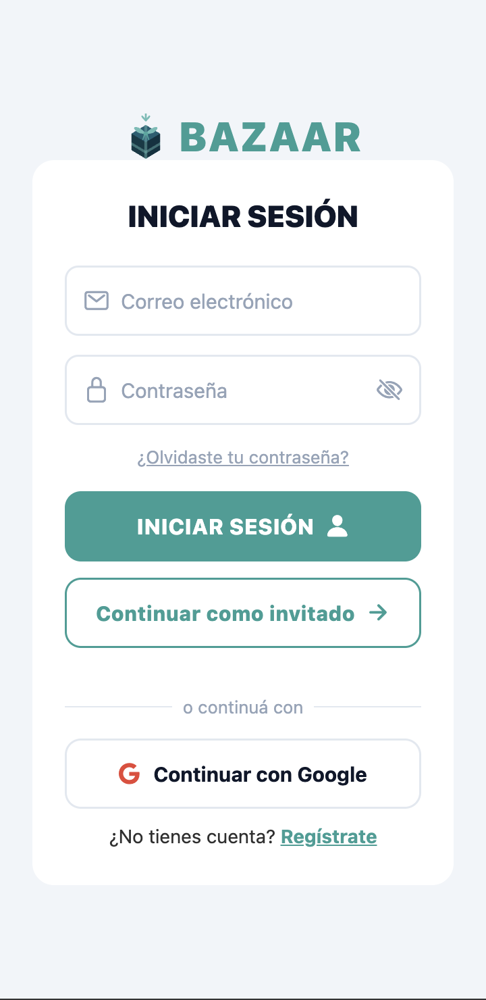

**Pasos:**
1. Abrí la app y tocá **Regístrate** en la pantalla de inicio de sesión.
2. Completá el campo **Nombre completo** con tu nombre y apellido.
3. Ingresá tu **Correo electrónico** (debe tener formato válido, por ejemplo `usuario@dominio.com`).
4. Ingresá una **Contraseña** que cumpla los siguientes requisitos: mínimo 8 caracteres, al menos una letra mayúscula, una letra minúscula y un número. El indicador de fortaleza debajo del campo te muestra en tiempo real qué tan segura es tu contraseña.
5. Tocá **REGISTRARME** para crear tu cuenta.

**Resultado:** La app te redirige automáticamente a la pantalla principal de Bazaar con tu sesión iniciada.

> **Notas:**
> - Si dejás el nombre en blanco, verás el mensaje: *"Se requiere ingresar un nombre"*.
> - Si el correo ya tiene una cuenta asociada, verás: *"No se pudo completar el registro con los datos proporcionados. Verificá los datos e intentá nuevamente."*
> - Si la contraseña no cumple los requisitos, la app te indica exactamente qué falta (longitud, mayúscula, minúscula o número).

---

### 2.3 Inicio de sesión

Accedé a tu cuenta existente con correo electrónico y contraseña.

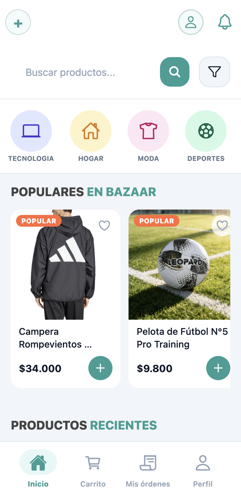

**Pasos:**
1. Abrí la app; si no estás logueado verás la pantalla **INICIAR SESIÓN**.
2. Ingresá tu **Correo electrónico**.
3. Ingresá tu **Contraseña** (podés tocar el ícono de ojo para mostrarla u ocultarla).
4. Tocá **INICIAR SESIÓN**.

**Resultado:** La app te lleva a la pantalla principal. Si el dispositivo soporta autenticación biométrica (huella dactilar o Face ID) o todavía no configuraste un PIN, la app te ofrecerá activarlos en ese momento.

> **Notas:**
> - Si el correo o la contraseña son incorrectos, verás: *"Dirección de correo electrónico o contraseña incorrectas"*.
> - Después de demasiados intentos fallidos, la cuenta se bloquea temporalmente y verás: *"Demasiados intentos fallidos. Esperá unos minutos antes de volver a intentarlo."*
> - Si tu cuenta fue bloqueada por el administrador, aparecerá un aviso específico indicándotelo.
> - Si ya activaste el inicio biométrico, verás el botón **Ingresar con biométrica**; si activaste PIN, verás **Ingresar con PIN**. Ambos son atajos al flujo completo de email/contraseña.
> - Podés explorar el catálogo sin cuenta tocando **Continuar como invitado**.

Debajo del formulario, la pantalla ofrece también la opción "o continuá con" seguida del botón **Continuar con Google** para iniciar sesión directamente con tu cuenta de Google, sin ingresar contraseña.

---

### 2.4 Inicio de sesión rápido con PIN

Configurá un PIN de acceso para ingresar a Bazaar sin escribir tu contraseña cada vez.

#### Configurar el PIN

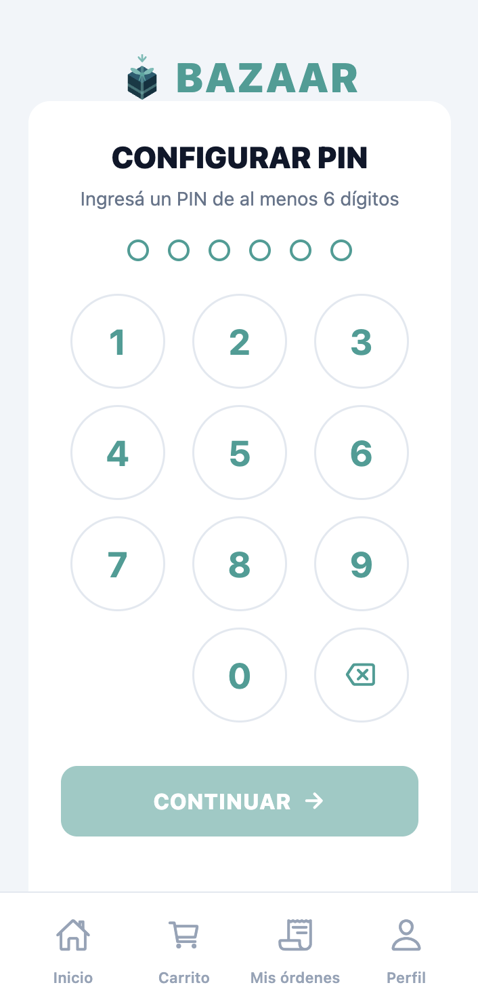

**Pasos:**
1. La app te ofrecerá configurar un PIN automáticamente al iniciar sesión por primera vez en el dispositivo. También podés iniciarlo desde tu perfil. En ambos casos se abre la pantalla **CONFIGURAR PIN**.
2. Ingresá un PIN de 6 dígitos usando el teclado numérico en pantalla.
3. Tocá **CONTINUAR**; la pantalla pasa a **CONFIRMAR PIN**.
4. Ingresá exactamente el mismo PIN para confirmarlo y tocá **CONFIRMAR**.

**Resultado:** El PIN queda guardado en el dispositivo. En futuros accesos verás el botón **Ingresar con PIN** en la pantalla de inicio de sesión.

> **Notas:**
> - Si los dos PINs no coinciden, verás *"Los PINs no coinciden. Intentá de nuevo."* y deberás ingresar el PIN desde el principio.
> - Podés posponer la configuración tocando **Configurar más tarde**.
> - Si el dispositivo ya tiene un PIN configurado por otra cuenta, antes del flujo de configuración aparece el paso **"VINCULAR AL PIN"** con el mensaje *"Este dispositivo ya tiene un PIN. Ingresalo para vincular tu cuenta también."* y el botón **VINCULAR**.

#### Usar el PIN para ingresar

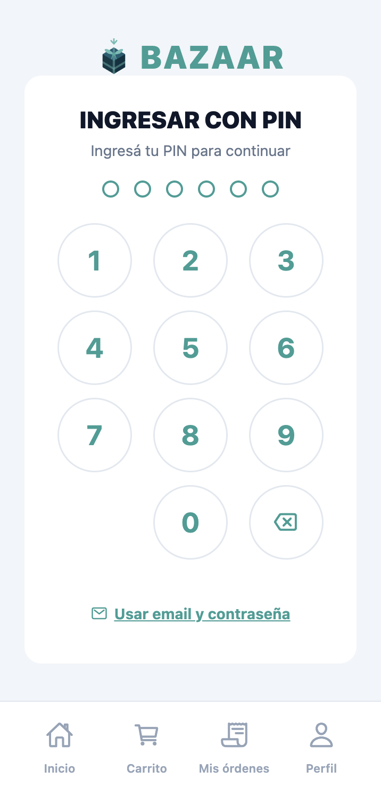

**Pasos:**
1. En la pantalla de inicio de sesión, tocá **Ingresar con PIN**.
2. Ingresá tu PIN dígito por dígito usando el teclado en pantalla. La verificación ocurre automáticamente al ingresar el sexto dígito.

**Resultado:** Si el PIN es correcto, accedés directamente a la app.

> **Notas:**
> - Tenés 3 intentos antes de que el acceso quede bloqueado temporalmente. Cada intento fallido muestra *"PIN incorrecto. Intentos restantes: N"*.
> - Si se superan los 3 intentos, la pantalla muestra *"Acceso bloqueado"* con un contador regresivo. Una vez vencido el tiempo, podés intentarlo de nuevo.
> - Si tu sesión expiró, verás *"Tu sesión expiró. Ingresá con email y contraseña para reactivar el PIN."* En ese caso usá el enlace **Usar email y contraseña**.

---

### 2.5 Recupero de contraseña

Restablecé tu contraseña si la olvidaste, usando un código de un solo uso enviado a tu correo.

#### Paso 1 — Solicitar el código

**Pasos:**
1. En la pantalla de inicio de sesión, tocá **¿Olvidaste tu contraseña?**
2. Ingresá tu **Correo electrónico** registrado en Bazaar.
3. Tocá **ENVIAR CÓDIGO**.

**Resultado:** Si el correo existe en el sistema, recibirás un email con un código de recuperación de 6 dígitos. La app avanza automáticamente a la pantalla de restablecimiento.

> **Nota:** Por seguridad, la app muestra el mismo mensaje independientemente de si el correo está registrado o no, para no revelar qué cuentas existen.

#### Paso 2 — Restablecer la contraseña

**Pasos:**
1. En la pantalla **RESTABLECER CLAVE**, verificá que tu **Correo electrónico** esté completo (se pre-carga automáticamente).
2. Ingresá el **Código de recuperación** de 6 dígitos que recibiste por email (solo se aceptan números).
3. Ingresá tu **Nueva contraseña** (mínimo 8 caracteres, una mayúscula, una minúscula y un número). El indicador de fortaleza te guía en tiempo real.
4. Repetí la contraseña en el campo **Confirmar nueva contraseña**.
5. Tocá **ACTUALIZAR CLAVE**.

**Resultado:** La app te redirige a inicio de sesión con el mensaje: *"Se ha actualizado tu contraseña correctamente. Inicia sesión con la nueva contraseña."*

> **Notas:**
> - Si el código es incorrecto o expiró, verás: *"Este código de recuperación es inválido o ha expirado. Solicita uno nuevo."*
> - Si las contraseñas no coinciden, verás: *"Las contraseñas ingresadas no coinciden"*.
> - Podés solicitar un nuevo código tocando **¿Necesitas otro código de recuperación?**

---

## 3. Navegación Principal de la App

La barra de navegación inferior es el punto de acceso central a las secciones de Bazaar. Está presente en todas las pantallas excepto durante el flujo de autenticación (inicio de sesión, registro, recupero de contraseña) y el proceso de pago. Contiene cuatro pestañas:

**Inicio** — Muestra la pantalla principal con categorías de productos, artículos populares, productos vistos recientemente y recomendaciones personalizadas. Es la única pestaña accesible sin haber iniciado sesión.

**Carrito** — Da acceso al carrito de compras. Cuando hay productos agregados, la pestaña muestra un indicador numérico con la cantidad de ítems (hasta "99+" para cantidades mayores). Requiere sesión iniciada; si no estás logueado, la app redirige al inicio de sesión.

**Mis órdenes** — Permite consultar el historial de compras y el estado de cada pedido (pendiente, confirmado, enviado, entregado, entre otros). También es donde se puede confirmar la recepción de un pedido y dejar una reseña al vendedor. Requiere sesión iniciada.

**Perfil** — Acceso al perfil propio del usuario: edición de datos personales, gestión de productos publicados, panel de ventas, cupones disponibles y configuración de seguridad (PIN). Requiere sesión iniciada.

---

## 4. Funcionalidades para Usuarios Finales

### 4.1 Gestión de Cuenta y Perfil

Accedé a tu perfil desde la pestaña **Perfil** de la barra de navegación. La pantalla muestra un menú lateral con las secciones disponibles bajo el título **Mi cuenta**: **Perfil**, **Publicaciones**, **Ventas**, **Wishlist** y **Cupones**.

La pestaña activa por defecto es **Perfil**, que concentra la información personal y la configuración de seguridad.

> **Nota:** Las secciones **Publicaciones**, **Ventas** y **Cupones** corresponden a funcionalidades de vendedor y se describen en detalle en la Sección 5.

#### Ver la información del perfil

La tarjeta **Información del perfil** muestra tu foto de perfil, nombre completo y correo electrónico registrado.

#### Editar la información del perfil

**Pasos:**
1. Tocá **Editar** en la esquina superior derecha de la tarjeta.
2. Para cambiar la foto, tocá el botón **Cambiar foto** sobre la imagen y seleccioná una nueva desde tu galería.
3. Modificá el campo **Nombre y Apellido** (máximo 50 caracteres).
4. Modificá el campo **Descripción** (máximo 500 caracteres; el contador debajo del campo te indica cuántos llevás).
5. Tocá **Guardar cambios** para confirmar, o **Cancelar** para descartar los cambios.

**Resultado:** La app muestra el mensaje "¡Perfil actualizado con éxito!" y la tarjeta vuelve al modo de solo lectura.

> **Notas:**
> - Si el nombre tiene entre 1 y 1 carácter, verás: *"El nombre debe tener al menos 2 caracteres"*.
> - Si el nombre supera los 50 caracteres, verás: *"El nombre no puede superar los 50 caracteres"*.
> - Si la descripción supera los 500 caracteres, verás: *"La descripción no puede superar los 500 caracteres"*.

#### Cambiar el tema de la aplicación

La tarjeta de información del perfil incluye una fila **Tema** con dos botones: **Claro** y **Oscuro**. Tocá el botón correspondiente para cambiar la apariencia de toda la aplicación de forma inmediata.

#### Configurar la seguridad desde el perfil

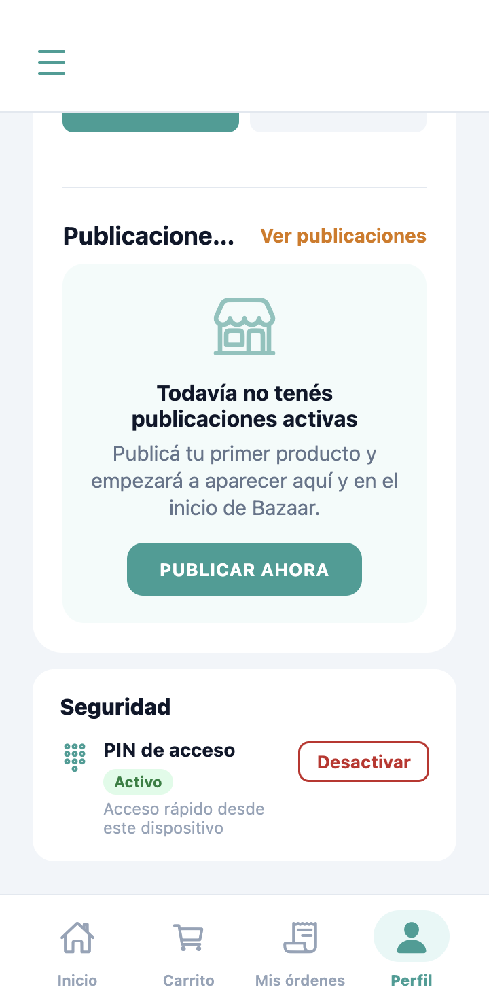

Debajo de la información personal se encuentra la sección **Seguridad**, con las siguientes opciones:

**PIN de acceso** — El estado del PIN se indica con un badge: **Activo** o **Inactivo**.

- Si el PIN está **Inactivo**, tocá **Activar** para ir a la pantalla de configuración de PIN (ver sección 2.4).
- Si el PIN está **Activo**, tocá **Desactivar** para deshabilitarlo.

**Datos biométricos** — Permite usar huella o reconocimiento facial para ingresar a la app. El estado se indica con un badge: **Activo** o **Inactivo**.

- Si está **Inactivo**, tocá **Activar**; la app lanza el lector biométrico nativo del dispositivo para confirmar y habilitar el acceso.
- Si está **Activo**, tocá **Desactivar** para deshabilitarlo.

---

### 4.2 Explorar el Catálogo

#### Pantalla principal

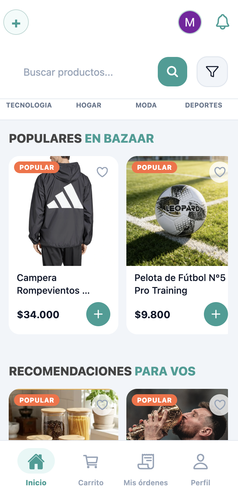

Al abrir la app, la pantalla de inicio muestra una barra de búsqueda en la parte superior y, debajo, un carrusel horizontal con las categorías disponibles en la plataforma. Tocar una categoría lleva directamente al listado filtrado por ella. En el extremo superior derecho hay un ícono de campana que abre la pantalla de **Notificaciones** (ver sección 4.7); si tenés notificaciones sin leer, el ícono muestra un badge con el conteo (hasta "9+" para cantidades mayores).

Más abajo se presentan tres secciones de productos en scroll horizontal:

- **POPULARES EN BAZAAR** — artículos con mayor demanda en la plataforma.
- **RECOMENDACIONES PARA VOS** — sugerencias personalizadas basadas en tu historial de navegación. Solo es visible para usuarios con sesión iniciada.
- **PRODUCTOS RECIENTES** — las publicaciones más nuevas del catálogo.

Tocar cualquier producto en estas secciones abre su pantalla de detalle.

#### Buscar y filtrar productos

Desde la pantalla de catálogo podés buscar, filtrar y ordenar el catálogo completo.

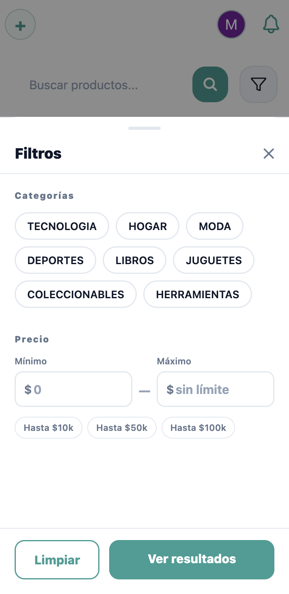

**Pasos:**
1. Ingresá el término de búsqueda en el campo **"Buscar productos..."** y tocá el ícono de lupa o presioná la tecla de búsqueda en el teclado.
2. Para ordenar los resultados, elegí una opción de la fila de chips debajo del buscador: **Recientes**, **Menor precio**, **Mayor precio** o **Relevancia**. Tocar el chip activo lo deselecciona y vuelve al orden por defecto.
3. Para filtrar por categoría o precio, tocá el ícono de filtros (embudo). Se abre el panel **Filtros** con dos secciones:
   - **Categorías** — chips con las categorías disponibles; tocá una para activarla, tocala de nuevo para deseleccionarla.
   - **Precio** — slider de rango mínimo y máximo.
4. Tocá **Ver resultados** para aplicar los filtros seleccionados, o **Limpiar** para restablecer todos a sus valores por defecto.

**Resultado:** El listado se actualiza mostrando la cantidad de productos encontrados. Si no hay resultados, aparece "No encontramos productos."

> **Nota:** El ícono de filtros muestra un indicador numérico cuando hay uno o más filtros activos.

#### Ver el detalle de un producto

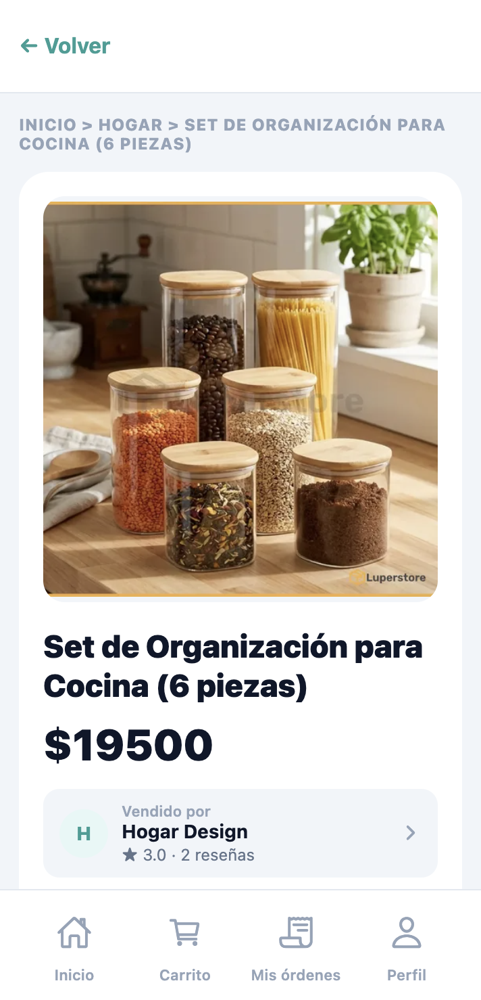

La pantalla de detalle reúne toda la información disponible sobre un artículo:

- **Galería de imágenes** — fotos del producto con miniaturas seleccionables.
- **Nombre y precio**.
- **"Vendido por [nombre]"** — texto con enlace al perfil público del vendedor.
- **Descripción** del artículo.
- **Selector de cantidad** con el stock disponible, visible cuando hay unidades en stock y el producto no es una publicación propia.
- **Calificaciones del producto** — puntuación promedio, cantidad de calificaciones y comentarios de compradores anteriores. Si aún no hay calificaciones, se muestra "Este producto aún no tiene calificaciones".

Las acciones disponibles desde esta pantalla son:

- Tocar el ícono **♡** en el encabezado para agregar o quitar el producto de tu wishlist (requiere sesión iniciada).
- Tocar **AÑADIR AL CARRITO** para agregar la cantidad seleccionada al carrito. El botón muestra **SIN STOCK** si no hay unidades disponibles, o **MÁXIMO EN CARRITO** si ya alcanzaste el límite disponible.
- Tocar **Compartir** para copiar o compartir el link del producto.

> **Nota:** Si la cuenta del vendedor fue suspendida, la pantalla muestra "Publicación no disponible" en lugar del detalle del producto.

---

### 4.3 Carrito de Compras

Accedé al carrito desde la pestaña **Carrito** de la barra de navegación. La pantalla se titula **Mi carrito** y muestra el listado completo de productos agregados.

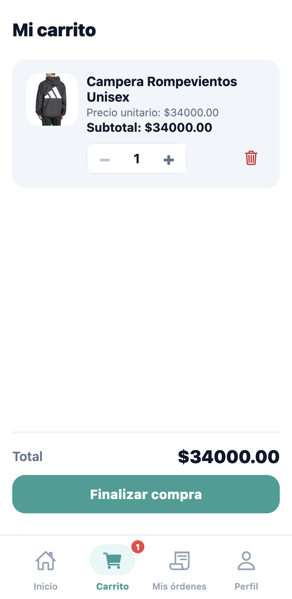

Si el carrito está vacío, aparece el mensaje "Tu carrito está vacío" y el botón **Ir al catálogo** para volver a explorar.

**Ajustar la cantidad de un ítem:**

**Pasos:**
1. Localizá el producto en el listado. Cada ítem muestra imagen, nombre, "Precio unitario: $X.XX" y "Subtotal: $X.XX".
2. Tocá **−** para reducir la cantidad o **+** para aumentarla. El mínimo es 1; el máximo está limitado por el stock disponible del producto.

**Resultado:** El subtotal del ítem y el total general se actualizan de inmediato.

**Eliminar un ítem:**

**Pasos:**
1. Tocá el ícono de tacho a la derecha del ítem que querés quitar.
2. En el diálogo de confirmación **Eliminar item**, leé el mensaje "¿Seguro que querés quitar [nombre del producto] del carrito?" y tocá **Eliminar** para confirmar, o **Cancelar** para volver.

**Resultado:** El producto se elimina del carrito y el total se recalcula.

**Productos no disponibles:**

Si algún ítem dejó de estar disponible desde que fue agregado, aparece con una etiqueta de aviso: "No disponible" (producto desactivado por el vendedor) o "Sin stock suficiente" (unidades insuficientes). En ese caso el área de resumen muestra la advertencia "Hay productos no disponibles. Quitalos para continuar." y el botón **Finalizar compra** permanece deshabilitado hasta que se eliminen todos los ítems con problemas.

**Avanzar al checkout:**

**Pasos:**
1. Verificá que no haya ítems marcados como no disponibles.
2. Tocá **Finalizar compra**.

**Resultado:** La app navega a la pantalla de confirmación de compra.

---

### 4.4 Checkout y Pago

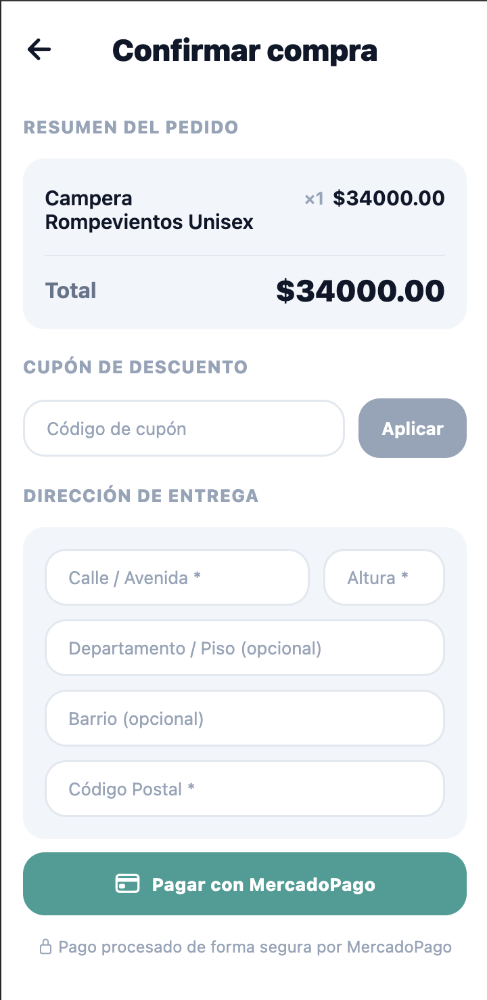

La pantalla **Confirmar compra** centraliza el resumen del pedido, el cupón de descuento, la dirección de entrega y el pago con MercadoPago.

**Pasos:**
1. Revisá la sección **Resumen del pedido**: lista de ítems con cantidad (×N) y subtotal, más el total final.
2. (Opcional) Si tenés un cupón, ingresá el código en el campo **"Código de cupón"** y tocá **Aplicar**. Si el cupón es válido, el descuento aparece en el resumen y el total se actualiza. Si no es válido, se muestra un mensaje de error debajo del campo.
3. Completá la sección **Dirección de entrega** con los siguientes campos:
   - **"Calle / Avenida \*"** — obligatorio, mínimo 2 caracteres.
   - **"Altura \*"** — obligatorio.
   - **"Departamento / Piso (opcional)"** — libre, sin validación.
   - **"Barrio (opcional)"** — libre, sin validación.
   - **"Código Postal \*"** — obligatorio, entre 4 y 8 caracteres (letras, números y guiones).
4. Tocá **Pagar con MercadoPago**.

**Resultado:** Se abre el checkout de MercadoPago en el navegador del dispositivo para completar el pago. Al volver a la app, aparece una de estas pantallas según el resultado:

| Estado | Título | Mensaje | Acciones disponibles |
|--------|--------|---------|----------------------|
| Confirmado | **¡Pago exitoso!** | "Tu orden fue confirmada. Podés seguir su estado en «Mis órdenes»." | **Ver mis órdenes** / **Seguir comprando** |
| Rechazado | **Pago rechazado** | "Tu pago no pudo procesarse. Podés intentarlo nuevamente o usar otro medio de pago." | **Reintentar pago** / **Volver al carrito** |
| En verificación | **Pago en proceso** | "Tu pago está siendo verificado por MercadoPago. Puede demorar unos minutos. Revisá el estado en «Mis órdenes»." | **Ver mis órdenes** |

> **Notas:**
> - Si la calle está vacía o es muy corta, verás: *"Ingresá el nombre de la calle."*
> - Si la altura está vacía, verás: *"Ingresá la altura."*
> - Si el código postal tiene longitud incorrecta, verás: *"El código postal debe tener entre 4 y 8 caracteres."* Si contiene caracteres no permitidos, verás: *"Solo letras, números y guiones."*
> - Mientras la app verifica el estado del pago con MercadoPago, se muestra la pantalla "Procesando tu pago…".

---

### 4.5 Historial de Compras

Accedé a tus órdenes desde la pestaña **Mis órdenes** de la barra de navegación. La pantalla muestra todas tus compras con sus estados actuales.

#### Ver el listado de órdenes

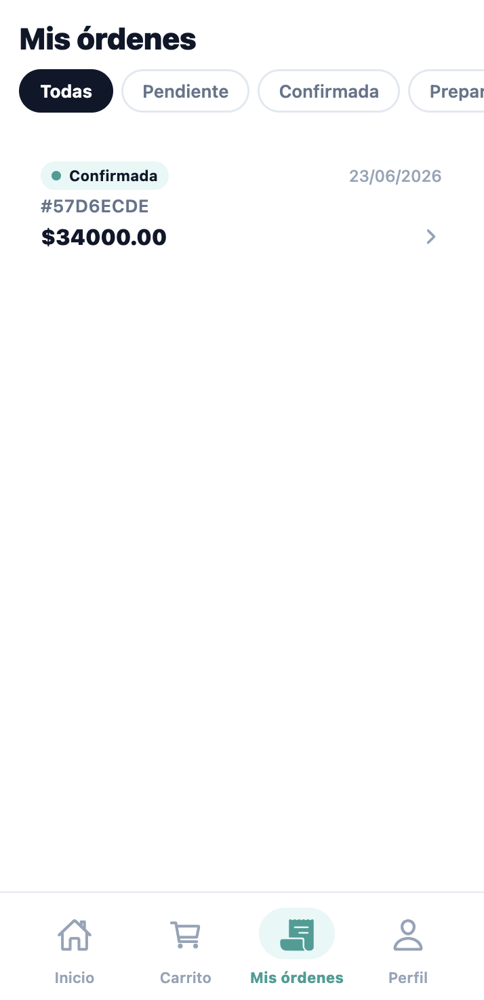

Cada tarjeta de orden muestra el estado, la fecha, el identificador de orden y el total. Para filtrar por estado, tocá uno de los chips de la fila horizontal: **Todas**, **Pendiente**, **Confirmada**, **Preparación**, **Enviada**, **Entregada**, **Rechazada** o **Cancelada**.

Los estados posibles de una orden son:

| Estado | Etiqueta |
|--------|----------|
| Pago pendiente de acreditación | "Pago pendiente" |
| Pago acreditado | "Confirmada" |
| El vendedor está preparando el envío | "En preparación" |
| Paquete en camino | "Enviada" |
| Paquete recibido | "Entregada" |
| Pago no acreditado | "Pago rechazado" |
| Orden anulada | "Cancelada" |
| Devolución en trámite | "Reembolso en proceso" |
| Devolución completada | "Reembolso procesado" |

Si no tenés órdenes, aparece el mensaje "Todavía no realizaste ninguna compra." y el botón **Ir al catálogo**. Si aplicaste un filtro sin resultados, verás "No tenés órdenes con ese estado."

**Órdenes con pago rechazado:** la tarjeta se destaca visualmente e incluye la leyenda "Tocá para reintentar la compra". Al abrirla, verás el banner "Tu pago fue rechazado" con el mensaje "No se pudo procesar el pago. Podés volver al carrito, revisar tus datos y reintentar la compra cuando quieras." y el botón **Volver al carrito**.

#### Ver el detalle de una orden

**Pasos:**
1. Tocá cualquier tarjeta de orden para abrir el panel **Detalle de orden**.

El panel muestra:

- Estado global de la orden con badge de color.
- **Dirección de entrega** declarada al hacer el pedido.
- **Productos comprados** — lista de ítems con nombre (tappable para ir al producto), cantidad, precio unitario y subtotal.
- **Seguimiento por paquetes** — cuando hay información disponible, cada paquete indica el vendedor, su estado individual y el código de seguimiento (si el vendedor lo cargó).
- **Total** de la orden.
- **Historial de la Orden** — línea de tiempo con los cambios de estado y sus fechas.

#### Confirmar la recepción de un paquete

Cuando el estado de un paquete es "Enviada", el panel de seguimiento muestra el botón **Confirmar que recibí este paquete**.

**Pasos:**
1. Abrí el detalle de la orden.
2. En la sección **Seguimiento por paquetes**, tocá **Confirmar que recibí este paquete** para el paquete correspondiente.

**Resultado:** El estado del paquete pasa a "Entregada" y se habilita la sección de calificaciones.

> **Nota:** Si no se puede confirmar la recepción, verás: *"No se pudo confirmar la entrega. Intentá de nuevo."*

#### Calificar una compra

Una vez que una orden tiene estado "Entregada", aparece la sección **Calificá tu compra** en el detalle. Podés calificar tanto a cada vendedor como a cada producto comprado.

**Pasos:**
1. Abrí el detalle de la orden entregada.
2. En la sección **Calificá tu compra**, seleccioná entre 1 y 5 estrellas para el vendedor o producto que querés calificar.
3. (Opcional) Escribí un comentario en el campo con placeholder "Comentario opcional...".
4. Tocá **Enviar calificación**.

**Resultado:** La app muestra "¡Calificación enviada!" en lugar del formulario.

> **Notas:**
> - Si ya calificaste a un vendedor, verás: *"Ya calificaste a este vendedor"*.
> - Si ya calificaste un producto, verás: *"Ya calificaste este producto"*.

#### Cancelar una orden

**Pasos:**
1. Abrí el detalle de la orden que querés cancelar.
2. Tocá **Cancelar orden** en la parte inferior del panel.
3. En el modal **¿Cancelar esta orden?** leé el mensaje: *"Se restaurará el stock. Si tenés pago aprobado, se iniciará un reembolso automáticamente."*
4. (Opcional) Ingresá un texto en el campo **Motivo (opcional)**.
5. Tocá **Sí, cancelar** para confirmar, o **Volver** para cerrar el modal sin cancelar.

**Resultado:** La orden pasa al estado "Cancelada" y, si el pago estaba acreditado, se inicia el proceso de reembolso automático.

---

### 4.6 Lista de Deseos

La wishlist te permite guardar productos para revisarlos más tarde. Accedé desde el menú lateral del perfil, tocando la pestaña **Wishlist**.

#### Ver la wishlist

La pantalla muestra el total de productos guardados (por ejemplo, "3 productos"). Cada tarjeta presenta la imagen, el nombre y el precio del artículo.

Si la wishlist está vacía, aparece el mensaje "Tu wishlist está vacía" con la indicación "Tocá el ♡ en cualquier publicación para guardar productos y encontrarlos acá fácilmente." y el botón **Explorar catálogo**.

Los productos pueden aparecer con etiquetas de estado:

- **No disponible** — el vendedor desactivó la publicación.
- **Sin stock** — el artículo está agotado.

Las tarjetas con estos estados no son tappables.

#### Agregar un producto a la wishlist

**Pasos:**
1. Abrí el detalle de cualquier producto del catálogo.
2. Tocá el ícono **♡** en el encabezado de la pantalla (requiere sesión iniciada).

**Resultado:** El ícono cambia a relleno y el producto aparece en tu wishlist.

#### Quitar un producto de la wishlist

**Pasos:**
1. En la pantalla de wishlist, tocá el ícono **♥** (corazón relleno) a la derecha de la tarjeta del producto que querés eliminar.

**Resultado:** El producto desaparece del listado.

---

### 4.7 Notificaciones

Accedé a tus notificaciones tocando el ícono de campana en la esquina superior derecha de la pantalla de inicio. La pantalla se titula **Notificaciones** y lista el historial completo de avisos recibidos.

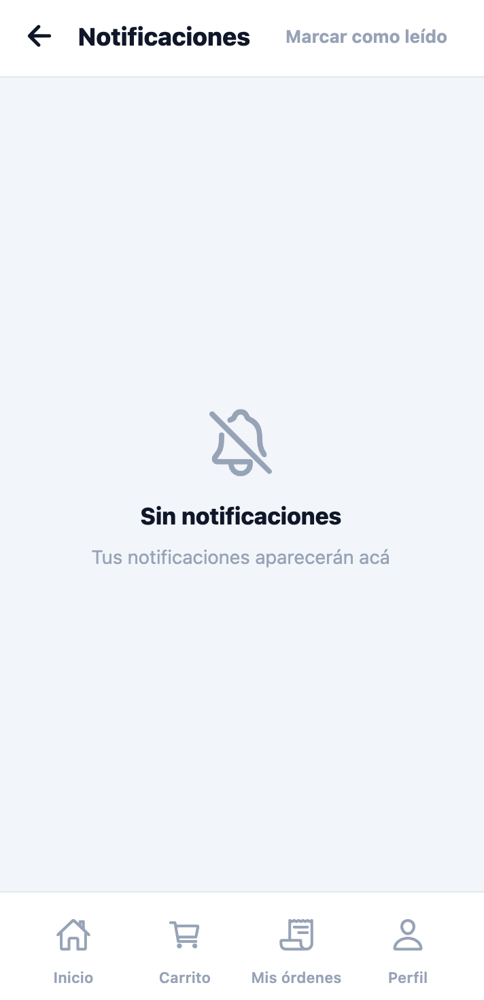

Cada notificación muestra un ícono identificador, un título, el cuerpo del mensaje y la antigüedad relativa: **Ahora** (menos de 1 minuto), **Hace N min** (hasta 59 minutos), **Hace N h** (hasta 23 horas) o **Hace N d** (hasta 6 días). Las notificaciones no leídas se destacan visualmente con un punto indicador.

Los tipos de notificaciones que podés recibir son:

- Actualizaciones de estado de tus órdenes: confirmación, en preparación, enviada, entregada, cancelada y pago rechazado.
- Avisos de stock bajo o agotado en tus publicaciones.
- Avisos de cupones nuevos disponibles.

Las notificaciones de órdenes son tappables y te llevan directamente al detalle de la orden correspondiente en **Mis órdenes**. Las notificaciones de stock te llevan a la pestaña **Publicaciones** de tu perfil.

#### Marcar todas como leídas

Tocá el botón **Marcar como leído** en el extremo superior derecho de la pantalla para marcar todas las notificaciones como leídas de una vez. El botón se deshabilita cuando no hay notificaciones sin leer.

Podés arrastrar hacia abajo la lista para recargar el historial.

#### Estados especiales

- Si no hay notificaciones, la pantalla muestra el título **"Sin notificaciones"** con la leyenda *"Tus notificaciones aparecerán acá"*.
- Si ocurre un error al cargar el historial, se muestra *"No se pudo cargar el historial"* y el botón **Reintentar**.

---

## 5. Vender en Bazaar

### 5.1 Publicar un Producto

#### Acceder a la pestaña Publicaciones

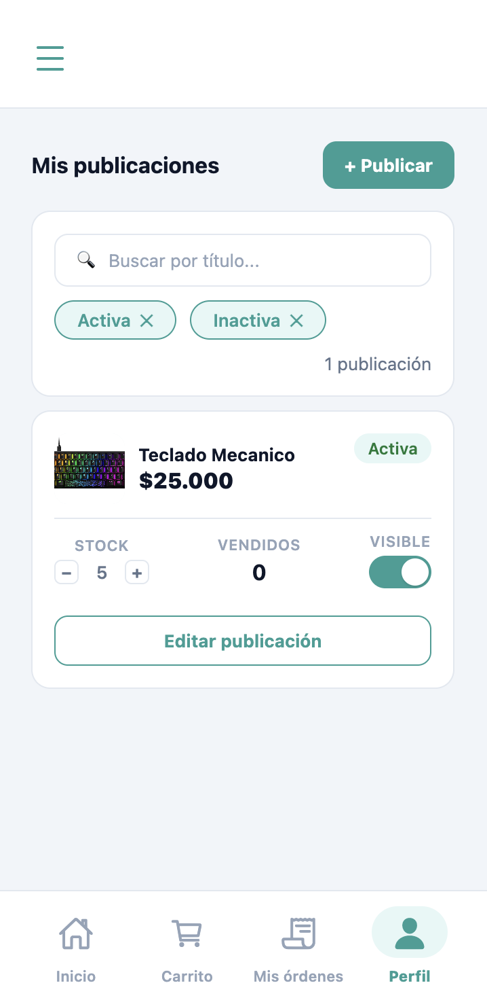

Desde la pestaña **Perfil** de la barra de navegación, tocá **Publicaciones** en el menú lateral. La pantalla muestra el listado de tus publicaciones bajo el título **Mis publicaciones** (en móvil) o **Gestión de publicaciones** (en pantallas más anchas).

Podés buscar por título usando el campo **"Buscar por título..."** y filtrar por estado tocando los chips **Activa** o **Inactiva**. Cada tarjeta indica el **Stock** actual, la cantidad de **Vendidos** y el interruptor **Visible** para activar o pausar la publicación en el catálogo.

Si todavía no tenés publicaciones, aparece el mensaje *"Todavía no tenés publicaciones."* con la leyenda *"Podés crear una y empezar a vender cuando quieras."* y el botón **Publicar ahora**.

#### Crear una publicación nueva

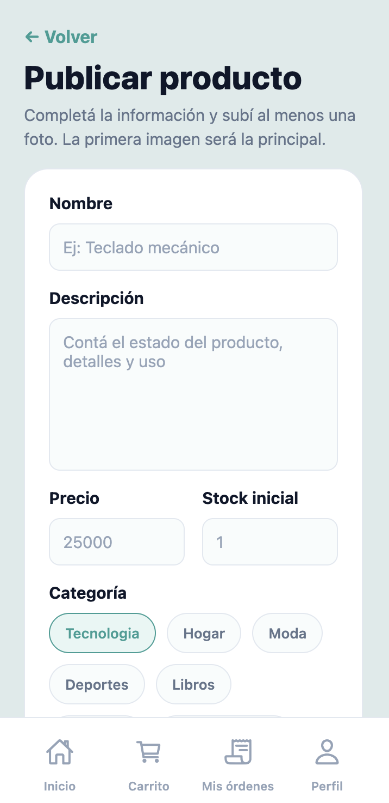

**Pasos:**
1. En la pantalla de publicaciones, tocá **+ Publicar** (esquina superior derecha) o **Publicar ahora** si el listado está vacío.
2. Se abre la pantalla **Publicar producto**. El subtítulo indica: *"Completá la información y subí al menos una foto. La primera imagen será la principal."*
3. Completá los campos:
   - **Nombre** — texto libre, máximo 120 caracteres. Placeholder: *"Ej: Teclado mecánico"*.
   - **Descripción** — texto multilínea, máximo 4000 caracteres. Placeholder: *"Contá el estado del producto, detalles y uso"*.
   - **Precio** — valor numérico mayor a cero. Placeholder: *"25000"*.
   - **Stock inicial** — número entero no negativo. Placeholder: *"1"*.
   - **Categoría** — tocá uno de los chips disponibles para seleccionar la categoría.
4. Tocá **Agregar fotos** para seleccionar imágenes desde tu galería. La sección indica: *"Hasta 5 imágenes JPG, PNG o WebP de 10 MB."* La primera imagen de la lista será la principal; podés reordenarlas arrastrando.
5. Tocá **Publicar producto** para confirmar.

**Resultado:** La publicación queda creada y visible en el catálogo. La app te redirige al listado de publicaciones.

> **Notas:**
> - Si el nombre está vacío, verás: *"El nombre es obligatorio"*.
> - Si la descripción está vacía, verás: *"La descripcion es obligatoria"*.
> - Si el precio está vacío, verás: *"El precio es obligatorio"*; si no es un número válido, *"El precio debe ser un numero valido"*; si es cero o negativo, *"El precio debe ser mayor a cero"*.
> - Si el stock está vacío, verás: *"El stock inicial es obligatorio"*; si no es un entero, *"El stock inicial debe ser un numero entero valido"*; si es negativo, *"El stock inicial no puede ser negativo"*.
> - Si no seleccionaste categoría, verás: *"La categoria es obligatoria"*.
> - Si no subiste ninguna imagen, verás: *"Debes subir al menos una imagen"*.
> - Podés tocar **Cancelar** en cualquier momento para volver sin guardar.

#### Editar una publicación existente

**Pasos:**
1. En el listado, localizá la tarjeta de la publicación que querés modificar.
2. Tocá **Editar publicación**.
3. Se abre un modal con los campos editables: nombre, descripción, precio, stock, categoría e imágenes.
4. Realizá los cambios y confirmá.

**Resultado:** La publicación queda actualizada de inmediato en el listado y en el catálogo.

> **Nota:** Si el administrador de la plataforma deshabilitó una publicación, su badge cambia a **Bloqueado** y aparece un aviso indicando que no podés modificarla hasta que sea rehabilitada. El botón **Editar publicación** y el interruptor **Visible** quedan deshabilitados durante el bloqueo.

#### Activar o desactivar una publicación

El interruptor **Visible** en cada tarjeta permite activar o pausar la visibilidad de la publicación en el catálogo en cualquier momento. El estado se refleja en el badge: **Activa** o **Inactiva**.

---

### 5.2 Tu Perfil Público de Vendedor

Cualquier usuario puede ver tu perfil público tocando el enlace **"Vendido por [nombre]"** en el detalle de cualquiera de tus productos publicados (ver sección 4.2).

El perfil muestra:

- **Foto y nombre completo** del vendedor.
- **Calificación promedio** — puntuación en estrellas y cantidad de reseñas recibidas (por ejemplo, "★ 4,7 · 12 reseñas"). Si todavía no hay calificaciones, se muestra *"Sin calificaciones aún"*.
- **Descripción** personal del vendedor (si la tiene configurada en su perfil).
- Sección **Calificaciones** — listado de reseñas con estrellas, fecha y comentario del comprador.
- Sección **Publicaciones activas** — grilla con los productos actualmente disponibles. Si el vendedor no tiene publicaciones activas, se muestra *"Este vendedor no tiene publicaciones activas"*.

> **Nota:** Si el perfil no está disponible (cuenta suspendida o eliminada), la pantalla muestra *"Este perfil no está disponible"*.

---

### 5.3 Panel de Ventas y Cupones

#### Ventas

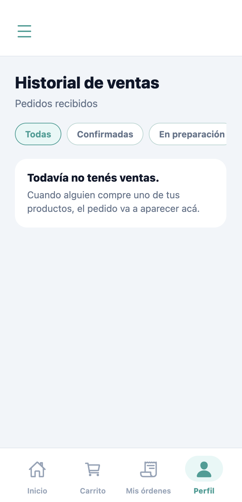

Accedé al panel desde la pestaña **Ventas** en el menú lateral del perfil. La pantalla muestra el título **Historial de ventas** y el subtítulo **Pedidos recibidos**.

Filtrá por estado con los chips horizontales: **Todas**, **Confirmadas**, **En preparación**, **Enviadas**, **Entregadas** o **Canceladas**.

Cada tarjeta de venta muestra:

- Badge de estado: **Confirmada**, **En preparación**, **Enviada**, **Entregada**, **Cancelada**, **Reembolso en proceso** o **Reembolsada**.
- Total de la venta correspondiente a tus productos.
- **Comprador** — nombre del comprador.
- **Entrega** — dirección de envío declarada en el pedido.
- **Productos** — listado de ítems con nombre, cantidad (×N) y subtotal.
- **Código de seguimiento** — si ya fue ingresado.

**Avanzar el estado de una venta:**

Cuando la venta puede avanzar de estado, aparece el botón **Pasar a [estado siguiente]**. Los estados progresan en orden: Confirmada → En preparación → Enviada. El paso a "Entregada" lo realiza el comprador (ver sección 4.5).

Al pasar a "Enviada", la app solicita un código de seguimiento:

**Pasos:**
1. Tocá **Pasar a Enviada**.
2. Se muestra el campo **Código de seguimiento opcional** con el placeholder *"Ej: AR123456789"* (máximo 100 caracteres).
3. Ingresá el código y tocá **Confirmar envío**, o tocá **Cancelar** para omitirlo.

**Cancelar una venta:**

Solo disponible para ventas en estado "Confirmada".

**Pasos:**
1. Tocá **Cancelar venta** en la tarjeta de la orden.
2. En el modal **¿Cancelar esta venta?** leé el mensaje: *"Se restaurará el stock. Si el comprador realizó un pago aprobado, se iniciará un reembolso."*
3. (Opcional) Ingresá un texto en el campo **Motivo (opcional)**.
4. Tocá **Sí, cancelar** para confirmar, o **Volver** para cerrar sin cancelar.

Si todavía no recibiste ventas, aparece el mensaje *"Todavía no tenés ventas."* con la leyenda *"Cuando alguien compre uno de tus productos, el pedido va a aparecer acá."*

#### Cupones

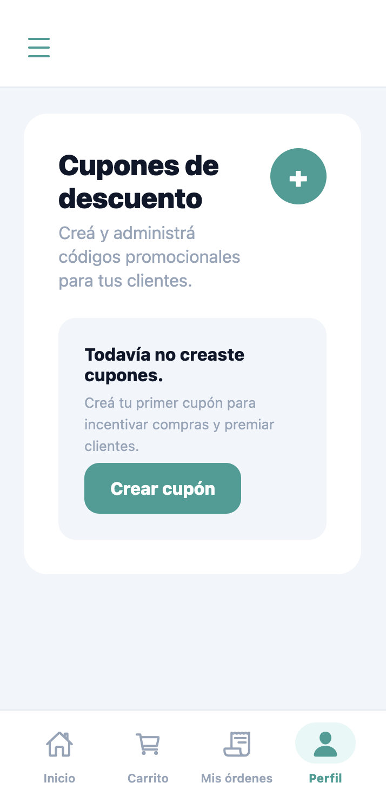

Accedé a los cupones desde la pestaña **Cupones** en el menú lateral del perfil. La pantalla muestra el título **Cupones de descuento** con el subtítulo *"Creá y administrá códigos promocionales para tus clientes."*

Cada tarjeta de cupón muestra el código, el porcentaje de descuento (**N% OFF**), la fecha de vencimiento (**Vence el DD/MM/AAAA**) y un badge de estado: **Activo**, **Inactivo** o **Vencido**.

**Crear un cupón:**

**Pasos:**
1. Tocá **Nuevo cupón**.
2. En el modal **Crear cupón**, completá los campos bajo el subtítulo *"Completá los datos del cupón para que quede disponible en la plataforma."*:
   - **Código** — texto en mayúsculas. Placeholder: *"Ej: VERANO20"*.
   - **Descuento (%)** — porcentaje numérico. Placeholder: *"Ej: 20"*.
   - **Vencimiento (AAAA-MM-DD)** — fecha en formato año-mes-día. Placeholder: *"Ej: 2026-12-31"*.
3. Tocá **Crear cupón** para confirmar, o **Cancelar** para cerrar sin guardar.

**Resultado:** El cupón queda disponible para que los compradores lo ingresen al hacer checkout.

**Activar o desactivar un cupón:**

En la tarjeta del cupón, tocá **Activar** o **Desactivar** para cambiar su estado. Los cupones con estado **Vencido** no pueden ser reactivados.

**Editar el vencimiento:**

Tocá el ícono de edición (lápiz) junto a la fecha de vencimiento del cupón. Se abre el modal **Editar vencimiento** con el campo **Vencimiento (AAAA-MM-DD)**. Tocá **Guardar cambios** para confirmar.

Si todavía no creaste cupones, aparece el mensaje *"Todavía no creaste cupones."* con la leyenda *"Creá tu primer cupón para incentivar compras y premiar clientes."* y el botón **Crear cupón**.

---

## 6. Vistas Públicas y Privadas

Bazaar distingue dos niveles de acceso según el estado de sesión del usuario.

### Vistas públicas

Las siguientes pantallas son accesibles sin haber iniciado sesión:

**Inicio (pantalla principal)** — El carrusel de categorías y las secciones de productos (**POPULARES EN BAZAAR** y **PRODUCTOS RECIENTES**) están disponibles para cualquier visitante. La sección **RECOMENDACIONES PARA VOS** solo aparece cuando hay sesión activa.

**Catálogo y búsqueda** — El listado completo de productos, los filtros por categoría y precio, y el ordenamiento por chips son accesibles sin cuenta.

**Detalle de producto** — La ficha completa del artículo (galería, precio, descripción, calificaciones, información del vendedor) se puede ver sin sesión. Las acciones **AÑADIR AL CARRITO** y el ícono **♡** (wishlist) están visibles, pero al intentar usarlas sin sesión la app redirige a la pantalla de inicio de sesión.

**Perfil público de vendedor** — La pantalla con el nombre, calificaciones y publicaciones activas del vendedor es accesible sin cuenta.

### Vistas privadas

Las siguientes pantallas requieren sesión iniciada. Al intentar acceder sin ella, la app redirige automáticamente a la pantalla de **INICIAR SESIÓN**, preservando la ruta original como destino de retorno para que la navegación continúe tras el login.

| Vista | Punto de acceso | Comportamiento sin sesión |
|---|---|---|
| **Carrito** | Pestaña **Carrito** de la barra de navegación | Redirige a inicio de sesión |
| **Checkout** | Botón **Finalizar compra** desde el carrito | Redirige a inicio de sesión |
| **Mis órdenes** | Pestaña **Mis órdenes** de la barra de navegación | Redirige a inicio de sesión |
| **Wishlist** | Pestaña **Wishlist** en el menú del perfil | Redirige a inicio de sesión |
| **Notificaciones** | Ícono de campana en la pantalla de inicio | Redirige a inicio de sesión |
| **Perfil propio** | Pestaña **Perfil** de la barra de navegación | Redirige a inicio de sesión |
| **Publicaciones, Ventas, Cupones** | Tabs del menú lateral del perfil | Redirigen a inicio de sesión |
| **Publicar producto** | Botón **+ Publicar** en la tab Publicaciones | Redirige a inicio de sesión |
